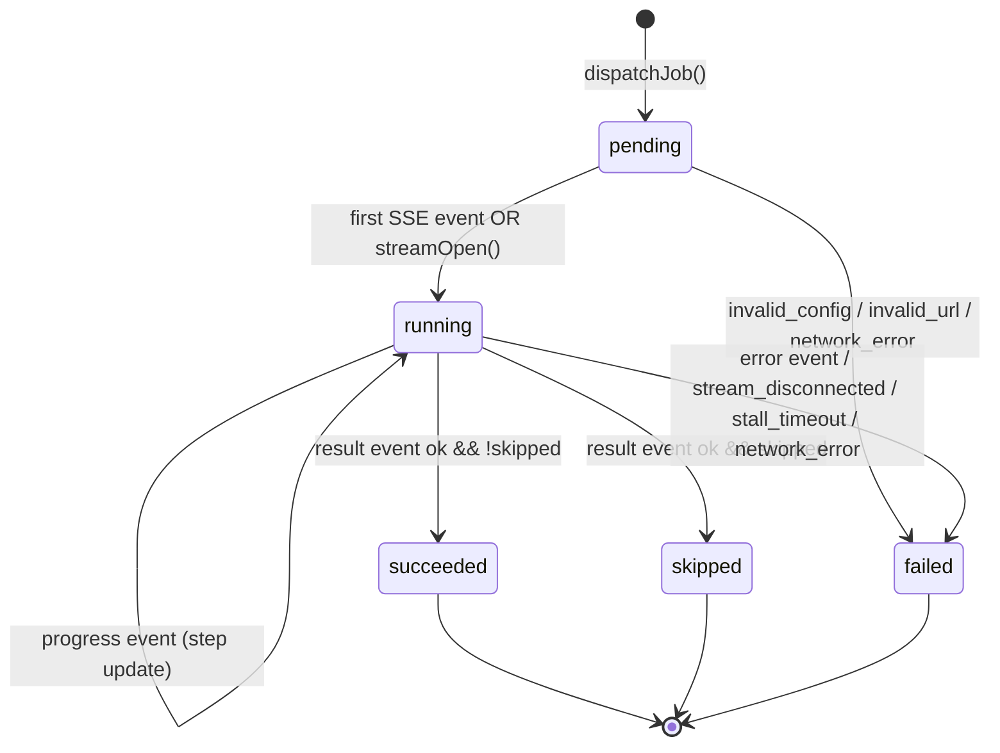

# Design Document

## Overview

The current Chrome extension performs the save inline from the popup: the popup opens a `fetch` against `/v1/process?stream=1`, reads the SSE_Stream in its own JavaScript context, and updates the DOM as events arrive. When the popup closes (tab switch, window blur, outside click) Chrome tears down that context and the SSE_Stream aborts mid-Job. For fast saves the user never notices; for slow LLM-driven saves (drafting and revising passes easily exceed 20 s) the Job is lost and the user has no feedback about why.

The redesign's central idea is to **decouple the Popup_View from Job execution**. The Popup_View becomes a dumb presentation of state that lives in the Background_Worker and `chrome.storage.local`: it sends a `dispatchJob` envelope, subscribes to `job-updated` broadcasts, and renders whatever the Job_Store currently holds. The Background_Worker owns the SSE_Stream lifecycle, persists each Progress_Step, handles terminal transitions, and emits notifications through the Notification_Service. Because MV3 service workers can themselves be evicted, all durable state (Notification_Preferences, Server_Config, Save_Behavior defaults, Job history) lives in `chrome.storage.local` and is re-read on each worker wake-up; only transient per-Job runtime state (the `ReadableStreamDefaultReader`, the AbortController, stall timers) stays in memory.

## Architecture

### Component diagram

```mermaid
graph LR
  subgraph ExtensionSurfaces
    PV[Popup_View<br/>src/popup.html + popup.js]
    OP[Options_Page<br/>src/options.html + options.js]
  end

  subgraph ServiceWorker[Background_Worker - src/background.js]
    DISP[Dispatcher<br/>message + command + menu handlers]
    JE[Job Engine<br/>SSE consumption, state machine]
    NS[Notification_Service<br/>emit + onClicked]
  end

  subgraph SharedModules
    AC[API_Client<br/>src/lib/api.ts]
    JS[Job_Store<br/>src/lib/jobStore.ts]
    CS[Config_Store<br/>src/lib/configStore.ts]
  end

  STORAGE[(chrome.storage.local)]
  SERVER[[Local Server<br/>127.0.0.1:8787]]
  OS[(chrome.notifications /<br/>OS notification center)]

  PV -- dispatchJob / getActiveJob --> DISP
  PV -- read --> JS
  PV -- read --> CS
  OP -- read/write --> CS
  OP -- healthz --> AC

  DISP --> JE
  JE --> AC
  JE --> JS
  JE --> NS
  AC -- fetch + SSE --> SERVER

  JS --> STORAGE
  CS --> STORAGE
  NS --> OS
  NS -- onClicked --> DISP

  STORAGE -. storage.onChanged .-> PV
  JE -. runtime.sendMessage job-updated .-> PV
```

### Responsibilities

- **Popup_View** — Render the current tab card, Save_Behavior overrides, primary action, running-job indicator, 5-row history, health footer. Dispatch `dispatchJob` / `retryJob` / `clearHistory`. Subscribe to `job-updated` broadcasts and `chrome.storage.onChanged` as a fallback. Never issues `POST /v1/process` directly.
- **Options_Page** — Render the four IA sections. Read/write `config.server`, `config.defaults`, `config.notifications`. Owns the only Test-Connection call (a one-shot `GET /v1/healthz` with a 5 s timeout). Owns non-loopback warning banner and inline validation.
- **Background_Worker** — Host process. Registers top-level listeners (`runtime.onMessage`, `commands.onCommand`, `contextMenus.onClicked`, `notifications.onClicked`, `runtime.onInstalled`) so they survive worker restart. Dispatches Jobs, runs the Job Engine, and owns the notification lifecycle.
- **API_Client** — Pure network module. One origin check per request, one redirect policy (`redirect: 'error'`), bearer attachment policy, `AbortController` for timeouts, SSE parser. No `chrome.*` calls so it can be unit-tested under Node.
- **Job_Store** — Pure CRUD over `jobs.history` in `chrome.storage.local` with LRU eviction at 20 items. No side effects beyond storage writes and a resolved Promise of the new state.
- **Notification_Service** — Wraps `chrome.notifications.create` / `.clear`. Reads `config.notifications` on each terminal transition. Maps `jobId → notificationId` via the `lp-job-{jobId}` convention. A single, top-level `onClicked` listener dispatches click routing.
- **Server** — Unchanged. Exposes `/v1/healthz`, `/v1/process`, `/v1/route`. The redesign is front-end only.

## Module Contracts

Interfaces are given in TypeScript syntax for clarity; the implementation language remains JavaScript with JSDoc (no build step change is required unless the user chooses to migrate).

### Background_Worker message handlers

```ts
type DispatchJobRequest = {
  type: 'dispatchJob';
  source: 'popup' | 'shortcut' | 'contextMenu' | 'notificationRetry';
  url: string;
  overrides?: Partial<SaveBehavior>;
  title?: string;      // optional; popup supplies tab.title, shortcut/menu may not
  faviconUrl?: string; // optional, same
};
type DispatchJobResponse =
  | { ok: true; jobId: string }
  | { ok: false; error: { code: string; message: string } };

type GetActiveJobRequest = { type: 'getActiveJob' };
type GetActiveJobResponse = { ok: true; job: Job | null };

type RetryJobRequest = { type: 'retryJob'; jobId: string };
type RetryJobResponse =
  | { ok: true; newJobId: string }
  | { ok: false; error: { code: string; message: string } };

type ClearHistoryRequest = { type: 'clearHistory' };
type ClearHistoryResponse = { ok: true; retained: number };

type OpenOptionsRequest = { type: 'openOptions' };
type OpenOptionsResponse = { ok: true };

type PopupToBackground =
  | DispatchJobRequest
  | GetActiveJobRequest
  | RetryJobRequest
  | ClearHistoryRequest
  | OpenOptionsRequest;
```

The handler is registered once at module top level:

```ts
chrome.runtime.onMessage.addListener(
  (msg: PopupToBackground, _sender, sendResponse) => {
    // discriminate on msg.type, respond async, return true
  }
);
```

### API_Client

```ts
export interface ServerConfig { url: string; token: string }

export interface ApiClient {
  /** GET /v1/healthz with 3 s (popup) or 5 s (options) timeout. Throws on non-2xx. */
  checkHealth(cfg: ServerConfig, timeoutMs: number): Promise<HealthPayload>;

  /** POST /v1/route (unused by this redesign but kept for parity). */
  route(url: string, cfg: ServerConfig): Promise<RoutePayload>;

  /**
   * POST /v1/process?stream=1 and yield SSE events as they arrive.
   * Honours AbortSignal for external cancellation; internally imposes a
   * 60 s idle timeout between events.
   */
  openProcessStream(
    url: string,
    overrides: SaveBehavior,
    cfg: ServerConfig,
    signal: AbortSignal
  ): AsyncIterable<SseEvent>;
}

export type SseEvent =
  | { type: 'progress'; data: { step: ProgressStep } }
  | { type: 'result';   data: ProcessResult }
  | { type: 'error';    data: { code: string; message: string } };
```

### Job_Store

```ts
export interface JobStore {
  /** Read-through from chrome.storage.local. Never throws; returns [] on missing. */
  list(): Promise<Job[]>;
  get(id: string): Promise<Job | null>;

  /** Upsert + LRU-cap at 20. Returns the post-state so callers can broadcast it. */
  persist(job: Job): Promise<Job[]>;

  /** Remove all jobs in terminal states; keep running. */
  clearTerminal(): Promise<Job[]>;

  /** Subscribe-style helper: fires `cb` with new list whenever `jobs.history` changes. */
  onChange(cb: (jobs: Job[]) => void): () => void;
}
```

### Notification_Service

```ts
export interface NotificationService {
  /**
   * Called exactly once per terminal transition. Reads config.notifications,
   * suppresses according to Notification_Preferences, builds the envelope, and
   * calls chrome.notifications.create. Swallows all errors and logs.
   */
  notifyTerminal(job: Job): Promise<void>;

  /** Fired-and-forgotten id-prefixed dismissal. */
  clear(jobId: string): Promise<void>;

  /** Must be invoked once at worker top level. */
  installClickHandler(): void;
}
```

## Data Model

```ts
// Canonical identifiers; never change in storage.
export type JobStatus = 'pending' | 'running' | 'succeeded' | 'skipped' | 'failed';

export type ProgressStep =
  | 'starting'
  | 'fetching'
  | 'preparing'
  | 'drafting'
  | 'extracting'
  | 'revising'
  | 'saving'
  | 'mirroring';

export type DuplicatePolicy = 'create' | 'skip' | 'update';
export type JobSource = 'popup' | 'shortcut' | 'contextMenu' | 'notificationRetry';

export interface SaveBehavior {
  duplicatePolicy: DuplicatePolicy;
  ossMirror: boolean;
}

export interface Job {
  id: string;                // uuidv4
  url: string;               // Supported_URL
  title: string | null;      // best-effort at dispatch time
  faviconUrl: string | null;

  source: JobSource;
  overrides: SaveBehavior;   // frozen at dispatch; does not mutate

  status: JobStatus;
  step: ProgressStep | null; // latest Progress_Step while running
  startedAt: string;         // ISO 8601 UTC, assigned at dispatch
  finishedAt: string | null; // ISO 8601 UTC, assigned on terminal transition

  // Terminal-only payload. Exactly one of these is non-null when status is terminal.
  result: {
    obsidianPath: string | null;
    ossUrl: string | null;
  } | null;
  error: {
    code: string;
    message: string;
  } | null;
}

export interface NotificationPreferences {
  onSuccess: boolean;
  onSkip: boolean;
  onFailure: boolean;
}

export interface ServerConfig {
  url: string;     // http(s) only, no trailing slash
  token: string;   // may be empty
}

// Persisted factory defaults for new Jobs; popup overrides never mutate this.
export interface SaveBehaviorDefaults extends SaveBehavior {}

// In-memory only, keyed by jobId. Never persisted because AbortControllers are not serializable.
interface ActiveJobRuntimeState {
  controller: AbortController;
  stallTimer: ReturnType<typeof setTimeout>;
  lastEventAt: number; // epoch ms
}
```

## Storage Layout

All persistent state lives under five keys in `chrome.storage.local`. The keys are intentionally namespaced so that a future migration can version individually.

| Key | Shape | Notes |
|---|---|---|
| `config.server` | `ServerConfig` | Owned by Options_Page. Re-read on every API_Client call. |
| `config.defaults` | `SaveBehaviorDefaults` | Factory default `{ duplicatePolicy: 'create', ossMirror: false }`. |
| `config.notifications` | `NotificationPreferences` | Factory default `{ onSuccess: true, onSkip: true, onFailure: true }`. |
| `jobs.history` | `Job[]` | Length bounded at 20. Ordered `startedAt` descending for read efficiency; eviction drops the tail. |
| `jobs.active` | `Record<string, { id: string; startedAt: string; step: ProgressStep \| null; status: 'pending' \| 'running' }>` | Optional breadcrumb that survives worker eviction mid-Job. On worker restart the Job Engine marks any orphaned entry as `failed` with code `WORKER_EVICTED`. Does NOT store AbortController. |

### Migration from v0.1.0

The current extension persists flat keys directly: `serverUrl`, `token`, `duplicatePolicy`, `ossEnabled`. On first run of the redesigned worker, `chrome.runtime.onInstalled` with `reason === 'update'` triggers a one-shot migration:

```ts
async function migrateV0ToV1(): Promise<void> {
  const raw = await chrome.storage.local.get([
    'serverUrl', 'token', 'duplicatePolicy', 'ossEnabled',
    'config.server' // presence check for idempotency
  ]);
  if (raw['config.server']) return; // already migrated
  await chrome.storage.local.set({
    'config.server': {
      url: raw.serverUrl ?? 'http://127.0.0.1:8787',
      token: raw.token ?? ''
    },
    'config.defaults': {
      duplicatePolicy: raw.duplicatePolicy ?? 'create',
      ossMirror: raw.ossEnabled ?? false
    },
    'config.notifications': { onSuccess: true, onSkip: true, onFailure: true }
  });
  // Legacy keys remain readable for one release, then removed.
}
```

The migration is idempotent: re-running it when `config.server` already exists is a no-op.

## Message Protocol

Every Popup_View ↔ Background_Worker envelope is a discriminated union on `type`. Every response carries an `ok` discriminator. All envelopes are validated at the handler boundary; unknown types return `{ ok: false, error: { code: 'UNKNOWN_MESSAGE', message: string } }`.

### Popup → Background (request / response)

| `type` | Request fields | Response on success | Response on failure | Timeout (popup-side) |
|---|---|---|---|---|
| `dispatchJob` | `url`, `source`, `overrides?`, `title?`, `faviconUrl?` | `{ ok: true, jobId }` | `{ ok: false, error }` | 2 s (Req 2.9) |
| `getActiveJob` | — | `{ ok: true, job: Job \| null }` | `{ ok: false, error }` | 1 s |
| `retryJob` | `jobId` | `{ ok: true, newJobId }` | `{ ok: false, error }` | 2 s |
| `clearHistory` | — | `{ ok: true, retained: number }` | `{ ok: false, error }` | 1 s |
| `openOptions` | — | `{ ok: true }` | — | 1 s |

### Background → Popup (broadcast, fire-and-forget)

```ts
type JobUpdatedBroadcast = {
  type: 'job-updated';
  jobId: string;
  job: Job; // full snapshot for idempotent rendering
};
```

Sent via `chrome.runtime.sendMessage(msg)` whenever the Job Engine writes a Job. The popup subscribes during `main()`:

```ts
chrome.runtime.onMessage.addListener((msg) => {
  if (msg?.type === 'job-updated') renderJob(msg.job);
});
```

### Storage-change fallback

Popup close drops live message listeners, but `job-updated` is advisory: the ground truth is `jobs.history` in storage. The popup also subscribes to `chrome.storage.onChanged` so that if the worker restarts during Popup_View open (edge case) state still reconciles:

```ts
chrome.storage.onChanged.addListener((changes, area) => {
  if (area !== 'local') return;
  if (changes['jobs.history']) renderHistory(changes['jobs.history'].newValue ?? []);
  if (changes['jobs.active'])  renderActive(changes['jobs.active'].newValue ?? {});
});
```

When both paths fire (broadcast arrives, then storage.onChanged) the renderer is idempotent because it reads by `jobId` and compares `status` + `step`.

## Job State Machine

### States

- `pending` — Job created and persisted, SSE_Stream not yet opened.
- `running` — SSE_Stream open, consuming events.
- `succeeded` — Terminal. Server returned `ok: true` with `obsidian.path`.
- `skipped` — Terminal. Server returned `ok: true, skipped: true`.
- `failed` — Terminal. Server returned an `error` event, SSE closed without a result, or a network/timeout/config error occurred.

### Transition diagram



### Persistence points

Every edge writes through the Job_Store before any downstream side effect:

| Edge | Write | Side effect |
|---|---|---|
| `* → pending` | `persist({ ...new, status:'pending', startedAt })` | Broadcast `job-updated`. |
| `pending → running` | `persist({ ...job, status:'running', step:'starting' })` | Broadcast. |
| `running → running` | `persist({ ...job, step: newStep })` | Broadcast. Does NOT notify. |
| `running → succeeded` | `persist({ ...job, status:'succeeded', finishedAt, result })` | Broadcast, then `notifyTerminal`. |
| `running → skipped` | `persist({ ...job, status:'skipped', finishedAt, result })` | Broadcast, then `notifyTerminal`. |
| `* → failed` | `persist({ ...job, status:'failed', finishedAt, error })` | Broadcast, then `notifyTerminal`. |

Terminal states are absorbing: the Job Engine never reads a Job whose status is terminal back into the runtime map (Req 5.10).

### Notification-emitting transitions

Only the three transitions into a terminal state emit notifications, and only if the matching Notification_Preferences toggle is enabled:

| Terminal state | Preference key | Title | Body |
|---|---|---|---|
| `succeeded` | `onSuccess` | "Saved to Obsidian" | `${title} ${obsidianPath}` truncated 200 |
| `skipped` | `onSkip` | "Already in vault" | `obsidianPath` truncated 200 |
| `failed` | `onFailure` | "Save failed" | `${code}: ${message}` truncated 300 |

## Async Save Execution Flow

The sequence below shows the popup-triggered save. Shortcut and context-menu flows skip the first two hops and start at `Dispatcher`.

```mermaid
sequenceDiagram
  autonumber
  participant User
  participant PV as Popup_View
  participant BW as Background_Worker<br/>(Dispatcher + Job Engine)
  participant JS as Job_Store
  participant AC as API_Client
  participant SRV as Server
  participant NS as Notification_Service

  User->>PV: click "Save to Obsidian"
  PV->>BW: dispatchJob { url, overrides, title, faviconUrl }
  BW->>JS: persist(pending Job)
  JS-->>BW: Job[]
  BW-->>PV: { ok:true, jobId }
  Note over PV: Re-enables button in &lt;200ms.<br/>Popup may close now.
  BW->>AC: openProcessStream(url, overrides, cfg, signal)
  AC->>SRV: POST /v1/process?stream=1
  SRV-->>AC: 200 + text/event-stream
  BW->>JS: persist(running, step='starting')
  BW-->>PV: job-updated (if still open)

  loop each SSE event until terminal or 60s idle
    SRV-->>AC: event: progress / data: {step}
    AC-->>BW: {type:'progress', data:{step}}
    BW->>JS: persist(step)
    BW-->>PV: job-updated (if still open)
  end

  alt result event received
    SRV-->>AC: event: result / data: {ok, obsidian, ...}
    AC-->>BW: {type:'result', data}
    BW->>JS: persist(succeeded|skipped, finishedAt, result)
    BW->>NS: notifyTerminal(job)
    NS-->>User: OS notification
  else stream idle >60s
    BW->>AC: controller.abort()
    BW->>JS: persist(failed, STREAM_DISCONNECTED, "stall timeout")
    BW->>NS: notifyTerminal(job)
  else network error
    AC-->>BW: throw
    BW->>JS: persist(failed, NETWORK, err.message)
    BW->>NS: notifyTerminal(job)
  end
```

**Popup-close survival.** Because the popup is not in the critical path between steps 4 and the terminal write, closing the popup after step 5 has no effect on the Job. The AbortController lives on the worker; the `signal` is never wired to any popup DOM event.

## SSE Consumption in the Service Worker

MV3 service workers do not expose `EventSource`. The consumer uses `fetch` + `ReadableStream` with a manual parser. Pseudocode:

```ts
async function* readSseStream(
  response: Response,
  signal: AbortSignal
): AsyncIterable<SseEvent> {
  if (!response.body) throw new Error('no response body');
  const reader = response.body.getReader();
  const decoder = new TextDecoder('utf-8'); // stream-safe across chunk boundaries
  let buffer = '';
  let lastActivity = Date.now();
  const STALL_MS = 60_000;

  const stallInterval = setInterval(() => {
    if (Date.now() - lastActivity > STALL_MS) {
      reader.cancel('stall_timeout').catch(() => {});
    }
  }, 5_000);

  signal.addEventListener('abort', () => {
    reader.cancel('aborted').catch(() => {});
  }, { once: true });

  try {
    while (true) {
      const { value, done } = await reader.read();
      if (done) return;
      lastActivity = Date.now();
      // UTF-8 edge case: multi-byte character split across TCP frames.
      // `{ stream: true }` is required so TextDecoder buffers partial code points
      // instead of emitting U+FFFD replacement characters.
      buffer += decoder.decode(value, { stream: true });

      let sep: number;
      while ((sep = buffer.indexOf('\n\n')) !== -1) {
        const chunk = buffer.slice(0, sep);
        buffer = buffer.slice(sep + 2);
        const evt = parseSseChunk(chunk);
        if (evt) yield evt;
      }
    }
  } finally {
    clearInterval(stallInterval);
    // Flush any tail bytes through the decoder.
    buffer += decoder.decode();
  }
}

function parseSseChunk(chunk: string): SseEvent | null {
  let event = 'message';
  let data = '';
  for (const rawLine of chunk.split('\n')) {
    const line = rawLine.replace(/\r$/, '');
    if (line.startsWith(':')) continue;             // comment per spec
    if (line.startsWith('event:')) event = line.slice(6).trim();
    else if (line.startsWith('data:')) data += (data ? '\n' : '') + line.slice(5).replace(/^ /, '');
  }
  if (!data) return null;
  try { return { type: event as any, data: JSON.parse(data) }; }
  catch { return { type: event as any, data: data as any }; }
}
```

**Worker shutdown.** If Chrome evicts the service worker mid-Job, the in-memory `AbortController`, `reader`, and stall timer are all destroyed synchronously. On next wake the Job Engine reads `jobs.active`, finds an orphan, and marks it `failed` with code `WORKER_EVICTED`. No zombie fetch continues (Chrome tears it down with the worker).

## Notification_Service Design

### Listener placement

`chrome.notifications.onClicked` must be added at module top level (before any `await`), otherwise it is not re-registered when Chrome wakes the worker from an eviction:

```ts
// background.js — top level
import { handleNotificationClick } from './lib/notificationService.js';
chrome.notifications.onClicked.addListener(handleNotificationClick);
```

### Id convention

`lp-job-{jobId}`. The `lp-` prefix namespaces the extension's notifications so that future notification types (`lp-update-available`, etc.) don't collide. Because the id is deterministic per Job, `chrome.notifications.create(id, ...)` replaces the existing notification in place rather than stacking — this is what `notifyTerminal` relies on even though for a correct state machine it is called exactly once per Job.

### Create envelope

```ts
chrome.notifications.create(`lp-job-${job.id}`, {
  type: 'basic',
  iconUrl: chrome.runtime.getURL('icons/128.png'),
  title,
  message: truncate(body, messageCap),
  priority: job.status === 'failed' ? 1 : 0,
  requireInteraction: false
});
```

### Suppression rules

1. Read `config.notifications`. If the matching toggle is `false`, return without creating.
2. If `chrome.storage.local.get` throws, treat as all-enabled (Req 6.7).
3. If `chrome.notifications.create` throws or invokes the callback with `chrome.runtime.lastError`, log at `warn` and return. The Job's stored status is never rolled back on notification failure (Req 5.8).

### onClicked routing

```ts
export async function handleNotificationClick(notificationId: string): Promise<void> {
  if (!notificationId.startsWith('lp-job-')) return;
  const jobId = notificationId.slice('lp-job-'.length);
  const job = await jobStore.get(jobId);
  await chrome.notifications.clear(notificationId);
  if (!job) return;

  if ((job.status === 'succeeded' || job.status === 'skipped') &&
      job.result?.obsidianPath) {
    await copyToClipboard(job.result.obsidianPath); // via offscreen document
    return;
  }
  if (job.status === 'failed') {
    await chrome.runtime.openOptionsPage();
  }
}
```

## UI Design (Popup)

### Wireframe

```
┌────────────────────────────────────────── 380 px ─┐
│ LinkProcessingAgent                           ⚙  │ ← 44 px header
├───────────────────────────────────────────────────┤
│ ┌──  Current tab  ────────────────────────────┐  │
│ │ [◉]  React 19 is out — what changed          │  │ ← favicon 20 px + title (trunc 60)
│ │      react.dev                                │  │ ← origin, muted
│ └──────────────────────────────────────────────┘  │
│                                                   │
│ ┌───────────────────────────────────────────────┐ │
│ │            Save to Obsidian                   │ │ ← 40 px primary, full width
│ └───────────────────────────────────────────────┘ │
│                                                   │
│ ▸ Override for this save                          │ ← collapsible, collapsed by default
│                                                   │
│ ── Running ──────────────────── drafting (pass 1) │ ← aria-live polite; hidden when none
│ ── Recent ─────────────────────────────────────── │
│ ✓ React 19 is out — what changed         2m ago  │ ← click to copy path
│ ↷ Already in vault: Deno 2.0              8m ago │
│ ✗ AUTH_FAILED  invalid token      [Retry] 1h ago │
│ ✓ TypeScript 5.5 release notes           3h ago  │
│ ✓ Zed adds vim mode                      1d ago  │
│                                    [ Clear ]     │
├───────────────────────────────────────────────────┤
│ server: healthy • http://127.0.0.1:8787           │ ← footer
└───────────────────────────────────────────────────┘
```

When the URL is unsupported (Req 1.11) the card, overrides, and primary action are replaced by a single inline message and the primary button is disabled with text "This page cannot be saved". History list still renders.

When the health check fails (Req 11.3) a dismissible banner renders above the tab card:

```
┌───────────────────────────────────────────────┐
│ ⚠ Server unreachable. Open settings →         │
└───────────────────────────────────────────────┘
```

### Design tokens

An 8-pt spacing scale and a 5-step type scale keep the popup dense but readable. Colors are declared as CSS custom properties gated on `prefers-color-scheme`.

```css
:root {
  /* Spacing — 8pt grid */
  --s-1: 4px;  --s-2: 8px;  --s-3: 12px; --s-4: 16px;
  --s-5: 24px; --s-6: 32px; --s-7: 48px;

  /* Type scale */
  --fs-xs: 11px; --fs-sm: 12px; --fs-md: 13px; --fs-lg: 15px; --fs-xl: 18px;
  --fw-regular: 400; --fw-medium: 500; --fw-semibold: 600;

  /* Radii / borders */
  --radius-sm: 4px; --radius-md: 8px;
  --border-width: 1px;

  /* Light scheme — WCAG AA verified against 4.5:1 */
  --bg:        #ffffff;
  --bg-muted:  #f5f5f7;
  --fg:        #1d1d1f;      /* 16.05:1 on --bg */
  --fg-muted:  #515154;      /* 7.6:1  on --bg */
  --accent:    #0a66c2;      /* 5.6:1  on --bg */
  --ok:        #0a7a3a;
  --warn:      #8a5a00;
  --bad:       #a4262c;
  --border:    #d2d2d7;
  --focus:     #2c6bed;      /* 3:1 against --bg and --bg-muted */
}

@media (prefers-color-scheme: dark) {
  :root {
    --bg:        #1c1c1e;
    --bg-muted:  #2a2a2c;
    --fg:        #f2f2f7;     /* 15.6:1 */
    --fg-muted:  #a1a1a6;     /* 5.1:1 */
    --accent:    #4c9eff;
    --ok:        #5bd785;
    --warn:      #e6b85a;
    --bad:       #ff6b6b;
    --border:    #3a3a3c;
    --focus:     #7aa7ff;
  }
}
```

### Component inventory

| Component | Role |
|---|---|
| `<Header>` | Title + settings icon button. |
| `<TabCard>` | Favicon, truncated title, origin. Placeholder icon on favicon load failure (3 s timeout). |
| `<PrimaryAction>` | Full-width button. Disabled when URL unsupported or health unknown. |
| `<OverridesPanel>` | `<details>` element (collapsed default) holding Duplicate_Policy select and OSS_Mirror checkbox. |
| `<RunningJobRow>` | Visible only when `jobs.active` non-empty. Wired to `aria-live="polite"`. |
| `<HistoryList>` | Up to 5 `<HistoryRow>` elements. Empty state when `jobs.history` empty. |
| `<HistoryRow>` | Status glyph + title + relative timestamp. Retry button when failed. Click to copy (succeeded/skipped with path). |
| `<HealthFooter>` | `healthy` / `unreachable` / `checking` + configured origin. |
| `<HealthBanner>` | Rendered only on `unreachable` / `401`. Dismissible. |

## UI Design (Options)

### Wireframe

```
┌─────────────────────── 640 px main column ───────────────────────┐
│ LinkProcessingAgent Settings                                      │
│                                                                   │
│ ── Server Connection ─────────────────────────────────────────── │
│ ┌───────────────────────────────────────────────────────────────┐ │
│ │  Describe where the local server is reachable.                 │ │
│ │                                                                │ │
│ │  Server URL  [ http://127.0.0.1:8787               ]  Saved ✓  │ │
│ │  Loopback binding. Recommended.                                │ │
│ │                                                                │ │
│ │  Bearer token (optional) [ •••••••••                ]          │ │
│ │                                                                │ │
│ │  ⚠ Non-loopback host. Bearer token will be transmitted over    │ │  ← conditional banner
│ │     the network.                                               │ │
│ │                                                                │ │
│ │  [ Test connection ]     Connected: {"ok":true,…}              │ │
│ └───────────────────────────────────────────────────────────────┘ │
│                                                                   │
│ ── Default Save Behavior ──────────────────────────────────────── │
│ ┌───────────────────────────────────────────────────────────────┐ │
│ │  Used when you trigger a save without overriding.              │ │
│ │                                                                │ │
│ │  Duplicate policy  [ Create new         ▾ ]          Saved ✓  │ │
│ │  ☐ Mirror to OSS by default                                   │ │
│ └───────────────────────────────────────────────────────────────┘ │
│                                                                   │
│ ── Notifications ──────────────────────────────────────────────── │
│ ┌───────────────────────────────────────────────────────────────┐ │
│ │  Choose which outcomes should produce a system notification.   │ │
│ │                                                                │ │
│ │  ☑ Notify on success                                           │ │
│ │  ☑ Notify on skip                                              │ │
│ │  ☑ Notify on failure                                           │ │
│ └───────────────────────────────────────────────────────────────┘ │
│                                                                   │
│ ── Help ───────────────────────────────────────────────────────── │
│ ┌───────────────────────────────────────────────────────────────┐ │
│ │  How to run the server                                         │ │
│ │  $ pnpm build …                                                │ │
│ │  Keyboard shortcut                                             │ │
│ │  Default Alt+Shift+S. Customize at chrome://extensions/shortcuts│ │
│ └───────────────────────────────────────────────────────────────┘ │
└───────────────────────────────────────────────────────────────────┘
```

Below 560 px the main column becomes full-width with a minimum 16 px gutter (Req 7.4).

### Card layout

Each section uses a card with 1 px `--border`, `--radius-md`, 16 px internal padding, and a 24 px gap to the next card. Section headings use `--fs-lg` `--fw-semibold`; section descriptions use `--fs-sm` `--fg-muted`.

### "Saved" indicator pattern

Every auto-persisted control (not the Test button) renders a trailing transient label:

```html
<label>
  Duplicate policy
  <div class="row">
    <select id="duplicatePolicy">…</select>
    <span class="saved-indicator" data-state="idle" aria-live="polite"></span>
  </div>
</label>
```

State machine for the indicator:

- `idle` — hidden, empty.
- `saving` — shows a small spinner + "Saving…".
- `saved` — shows "Saved ✓" for 2000 ms, then returns to `idle` (Req 7.8).
- `error` — shows "Save failed" and reverts the control to last-persisted value (Req 7.9 / 6.6).

### Non-loopback warning banner

Rendered inside the Server Connection card, after the URL field, only while `isLoopback(parse(url)) === false`. Uses `--warn` accent and an `⚠` glyph. It is not dismissible because it describes a live security condition.

## Accessibility Design

### Focus management

- Initial focus on Popup_View open is on the primary action (Req 12.7). If disabled, focus moves to the first enabled control (gear button or first history row).
- Tab order follows DOM order top-to-bottom, left-to-right (Req 12.1). Hidden/disabled elements are excluded by their native semantics (no `tabindex` hacks).
- Button and role="button" elements respond to Enter and Space identically to mouse click (Req 12.2) — native `<button>` handles this; we do not wrap primary actions in `<div>`.
- After a history row's "copied" confirmation expires, focus stays on the row to support keyboard users copying multiple paths in sequence.

### aria-live regions

```html
<div id="progressLive" aria-live="polite" aria-atomic="true" class="visually-hidden"></div>
<div id="errorLive"    aria-live="assertive" aria-atomic="true" class="visually-hidden"></div>
```

- Progress_Step changes and non-failure terminal transitions update `#progressLive` (Req 12.3).
- Failures additionally update `#errorLive` with "Save failed: {code} {message}" (Req 12.4). The prior progress message is NOT removed from `#progressLive` to preserve assistive technology context.

### Label strategy (Options_Page)

Every control uses an explicit `<label for="id">` paired with a control `id` (Req 12.5). Checkbox labels use the "label wraps input" pattern which still qualifies as associated. No placeholder-as-label is permitted.

### Focus ring tokens

```css
:focus-visible {
  outline: 2px solid var(--focus);
  outline-offset: 2px;
  border-radius: var(--radius-sm);
}
```

`--focus` is chosen per-scheme so that the focus ring achieves ≥3:1 contrast against every background it lands on (Req 12.6).

## API_Client Hardening

### Origin extraction

A single helper is used by both request issuance and redirect policy:

```ts
function parseOrigin(raw: string): { scheme: string; host: string; port: string } | null {
  try {
    const u = new URL(raw);
    if (u.protocol !== 'http:' && u.protocol !== 'https:') return null;
    return { scheme: u.protocol, host: u.hostname, port: u.port || (u.protocol === 'http:' ? '80' : '443') };
  } catch { return null; }
}

function sameOrigin(a: string, b: string): boolean {
  const oa = parseOrigin(a), ob = parseOrigin(b);
  return !!oa && !!ob && oa.scheme === ob.scheme && oa.host === ob.host && oa.port === ob.port;
}
```

### Per-request origin check

Before every outbound call:

```ts
if (!sameOrigin(targetUrl, cfg.url)) {
  throw new ApiError('ORIGIN_MISMATCH', `refuse request to ${targetUrl}: not the configured server origin`);
}
```

### Redirect policy

```ts
await fetch(targetUrl, {
  method, headers, body, signal,
  redirect: 'error'    // any 3xx Location header surfaces as a TypeError
});
```

`redirect: 'error'` means the browser treats a redirect as a network error, so there is no way a follow-up request leaks the bearer token (Req 13.3). We explicitly prefer this over `manual` because `manual` still returns an opaque response that callers might accidentally treat as success.

### Bearer attachment policy

```ts
function authHeaders(cfg: ServerConfig, targetUrl: string): Record<string, string> {
  if (!cfg.token) return {};
  if (!sameOrigin(targetUrl, cfg.url)) return {}; // double-insurance with origin check
  return { authorization: `Bearer ${cfg.token}` };
}
```

### Timeouts

Every entry point accepts an `AbortSignal`. Internal timeouts use `AbortSignal.timeout(ms)` composed with the caller signal via `AbortSignal.any([a, b])` when available; otherwise a polyfilled composer. The Job Engine owns the 60 s stall timer separately because it must reset on each SSE event rather than firing from a fixed deadline.

## Testing Strategy

### Unit tests (pure modules, Vitest)

- `jobStore.ts` — LRU eviction, `clearTerminal`, `onChange` debouncing.
- `format.ts` — relative timestamp formatter, truncation helper, Progress_Step → label map.
- `url.ts` — `isLoopback`, `isSupportedUrl`, `parseOrigin`, `sameOrigin`.
- `sseParser.ts` — `parseSseChunk` against representative fixtures including multi-line `data:`, comments, and `\r\n` terminators.
- `notificationService.ts` — preference gating, id derivation, suppression on disabled preference.

### Property-based tests (fast-check)

Each property is implemented as a single `fc.assert` call with `numRuns: 100` (minimum). Tags follow the workflow's **Feature: chrome-extension-redesign, Property N: ...** convention and live as JSDoc `@property` comments. The properties themselves are enumerated in the next section.

### Integration tests (Vitest + stub `chrome.*`)

- `fake-indexeddb`-style hand-rolled `chrome.storage.local` stub persists across test helpers.
- `chrome.runtime.onMessage` is modelled as an EventTarget; the popup harness asserts it receives `job-updated` within the time budget.
- Mocked SSE via a `ReadableStream` constructed from an array of chunks; tests assert end-to-end Job transitions (pending → running → succeeded) and the notification envelope.
- Simulated worker eviction: drop the active runtime map, dispatch a new `onInstalled`, assert orphaned Jobs become `failed/WORKER_EVICTED`.

### Manual visual review checklist

Before release the reviewer walks through:

1. Popup in light and dark mode.
2. Popup with 0, 1, and 5 history rows.
3. Popup with running Job + live Progress_Step announcement (screen-reader on).
4. Options_Page at 560 px, 720 px, and 320 px viewport widths.
5. Non-loopback URL → warning banner appears.
6. 401 response from Test connection → inline error, no persistence change.
7. Keyboard-only navigation of both surfaces.

## Correctness Properties

*A property is a characteristic or behavior that should hold true across all valid executions of a system — essentially, a formal statement about what the system should do. Properties serve as the bridge between human-readable specifications and machine-verifiable correctness guarantees.*

The Chrome extension has a meaningful pure core (URL parsing, truncation, timestamp formatting, LRU eviction, state machine transitions, origin equality) and a shell of `chrome.*` side effects. Every property below targets the pure core and is implemented as a single fast-check property with at least 100 iterations. Each property is tagged with **Feature: chrome-extension-redesign, Property N: {title}** as a JSDoc comment above the test.

### Property 1: Job_Store LRU eviction is bounded and drops oldest first

*For all* sequences of `Job` values `[j1, j2, …, jk]` with pairwise distinct `startedAt` timestamps inserted in order via `Job_Store.persist`, the resulting history satisfies `length = min(k, 20)`; when `k > 20`, the 20 retained Jobs are exactly the 20 with the greatest `startedAt` values; the retained list is sorted by `startedAt` descending.

**Validates: Requirements 4.1, 4.2**

### Property 2: Relative timestamp formatter is monotone non-decreasing and boundary-consistent

*For all* non-negative elapsed-millisecond pairs `(a, b)` with `a ≤ b`, the numeric component of `formatRelative(a)` compared inside the same bucket satisfies `numeric(formatRelative(a)) ≤ numeric(formatRelative(b))`; the bucket suffix (`s`, `m`, `h`, `d`) is chosen according to the boundaries `[0, 60 000) → s`, `[60 000, 3 600 000) → m`, `[3 600 000, 86 400 000) → h`, `[86 400 000, ∞) → d`; and, with documented floor-rounding, `parseRelative(formatRelative(e))` returns an interval containing `e`.

**Validates: Requirements 4.4**

### Property 3: Truncation respects its length cap and preserves short inputs

*For all* strings `s` and integer caps `n ≥ 1`, `truncate(s, n)` satisfies `length(truncate(s, n)) ≤ n`; when `length(s) ≤ n`, `truncate(s, n) === s`; when `length(s) > n`, `truncate(s, n).endsWith('…')`.

**Validates: Requirements 1.3, 4.4, 5.1, 5.2, 5.3, 11.5**

### Property 4: Progress_Step label map is total and falls through unchanged

*For all* strings `s`, `stepToLabel(s)` never throws and returns a string; when `s` is one of the eight defined `ProgressStep` identifiers, the returned label is the corresponding entry in the static table; when `s` is any other string, `stepToLabel(s) === s`.

**Validates: Requirements 3.4, 3.5**

### Property 5: URL validation predicates agree with their parsed URL

*For all* strings `u`, `isSupportedUrl(u)` is `true` iff `u` parses as a URL whose protocol is `http:` or `https:`; and, for all such supported URLs `u`, `isLoopback(u)` is `true` iff the parsed `host` is one of `'127.0.0.1'`, `'::1'`, or `'localhost'`; `isLoopback` is invariant under adding or removing a port component.

**Validates: Requirements 1.11, 8.2, 8.3, 8.4**

### Property 6: Same-origin equality is reflexive, symmetric, and transitive

*For all* pairs of URL strings `a`, `b`, `c` that parse successfully with `http(s)` schemes, `sameOrigin(a, a) === true`; `sameOrigin(a, b) === sameOrigin(b, a)`; and if `sameOrigin(a, b)` and `sameOrigin(b, c)` are both `true`, then `sameOrigin(a, c) === true`.

**Validates: Requirements 13.1, 13.2** (structural prerequisite)

### Property 7: Network requests and bearer headers are confined to the configured origin

*For all* target URL strings `t`, `ServerConfig` values `cfg`, and method/body/headers, the instrumented `API_Client` either throws with code `ORIGIN_MISMATCH` (when `sameOrigin(t, cfg.url) === false`) or issues exactly one `fetch` call whose `url` is same-origin with `cfg.url`; the issued request includes the `authorization: Bearer ${cfg.token}` header iff `cfg.token` is a non-empty string AND `sameOrigin(t, cfg.url) === true`.

**Validates: Requirements 13.1, 13.2**

### Property 8: Job state machine invariants — terminal states absorb and are structurally well-formed

*For all* finite event sequences `E = [e1, e2, …, en]` delivered to the Job Engine for a single Job (where events are drawn from `{progress(step), result(payload), errorEvent(code,msg), streamClose, stallTimeout, networkError}`), every intermediate and final persisted `Job` value satisfies: (a) once `status ∈ {succeeded, skipped, failed}`, no subsequent state with a different status is ever persisted for that Job; (b) whenever `status ∈ {succeeded, skipped, failed}`, `finishedAt` is a string parseable by `Date` that round-trips via `new Date(s).toISOString() === s`, and exactly one of `{result, error}` is non-null matching the status; (c) the state-machine simulation reaches a terminal state whenever `E` includes any of `result`, `errorEvent`, `streamClose`, `stallTimeout`, or `networkError`; (d) `notifyTerminal` is invoked at most once per Job and never on a `progress` event.

**Validates: Requirements 3.6, 5.10**

### Property 9: Notification emission honors preferences, with fallback on read failure

*For all* `NotificationPreferences` values `P` (including the synthetic "read-failed" marker) and terminal `Job` values `j`, `notifyTerminal(j)` emits exactly one notification iff: (a) reading `P` succeeded AND the preference matching `j.status` is `true`, OR (b) reading `P` failed (the all-enabled fallback); otherwise it emits zero notifications. In all cases the stored Job value is unchanged.

**Validates: Requirements 5.9, 6.4, 6.5, 6.7**

### Property 10: Notification emit failures do not mutate Job state

*For all* terminal `Job` values `j` and injected `chrome.notifications.create` error outcomes `e` (throws, `lastError`, asynchronous rejection), the post-call Job read from `Job_Store` is structurally equal to `j`.

**Validates: Requirements 5.8**

### Property 11: Notification id bijection

*For all* `jobId` strings `id` containing no slashes or whitespace, `notificationIdFor(id) === \`lp-job-${id}\`` and `parseNotificationId(notificationIdFor(id)) === id`; for all strings `s` not starting with `'lp-job-'`, `parseNotificationId(s) === null`.

**Validates: Requirements 5.5**

### Property 12: Notification envelope is source-invariant

*For all* pairs of terminal `Job` values `j1`, `j2` that agree on every field except `source`, `buildNotificationEnvelope(j1)` deep-equals `buildNotificationEnvelope(j2)`.

**Validates: Requirements 10.4**

### Property 13: Job schema is source-invariant

*For all* dispatch inputs `d` and all `source` values in `{popup, shortcut, contextMenu}`, the `Job` produced by `createPendingJob(d, source)` has the same set of keys, the same value types per key, and satisfies all `Job` shape invariants (non-empty `id`, valid ISO `startedAt`, `status === 'pending'`, `overrides` frozen and non-null).

**Validates: Requirements 10.1, 10.2, 10.3**

### Property 14: Retry produces an equivalent dispatch

*For all* failed `Job` values `j`, `buildRetryDispatch(j)` returns a `DispatchJobRequest` whose `url === j.url` and `overrides` deep-equals `j.overrides`, with a fresh `id` not equal to `j.id`.

**Validates: Requirements 4.7**

### Property 15: clearTerminal keeps running Jobs, drops everything else

*For all* `Job[]` histories `H`, `clearTerminal(H)` equals `H.filter(j => j.status === 'running')` element-wise, preserving order.

**Validates: Requirements 4.8**

### Property 16: Per-save override does not mutate stored Save_Behavior defaults

*For all* persisted defaults `D`, arbitrary override values `O`, and arbitrary dispatch URLs `u`, invoking `dispatchJob(u, O)` leaves `readSaveBehaviorDefaults()` deep-equal to `D` both immediately after dispatch and after the Job reaches any terminal state.

**Validates: Requirements 9.4**

### Property 17: Invalid persisted Save_Behavior reads fall back to factory defaults

*For all* arbitrary JSON values `v` written under `config.defaults` that are not structurally a `SaveBehavior`, `readSaveBehaviorDefaults()` returns the factory defaults `{ duplicatePolicy: 'create', ossMirror: false }` without throwing.

**Validates: Requirements 9.6**

### Property 18: Popup history rendering is take-5-sorted-descending

*For all* `Job[]` inputs `H`, `renderHistoryRows(H)` returns the list `H.slice().sort(byStartedAtDescending).slice(0, 5)`.

**Validates: Requirements 4.3**

### Property 19: Unique Job identifiers across the history window

*For all* sequences of `createPendingJob` calls producing `k ≤ 20` Jobs that end up in `Job_Store.list()`, the set of `id` values has size exactly `k`.

**Validates: Requirements 2.8**

## Error Handling

The redesign distinguishes four error families. Each has a defined code, a UI presentation, and a recovery path.

| Family | Error codes | Source | UI presentation | Recovery |
|---|---|---|---|---|
| **Config** | `NO_SERVER`, `INVALID_URL`, `ORIGIN_MISMATCH` | Background_Worker startup or API_Client pre-flight | Failure notification + popup banner "Server not configured" with link to Options_Page (Req 13.4) | User edits Options_Page |
| **Network** | `NETWORK`, `STREAM_DISCONNECTED` | API_Client fetch, SSE reader | Failure notification + failed history row with code and truncated message | User runs `doctor` or retries the Job |
| **Auth** | `AUTH_FAILED` (HTTP 401) | API_Client response | Popup auth banner linking to Options_Page (Req 11.4) | User sets/clears bearer token |
| **Server-reported** | `FETCH_FAILED`, `LLM_OUTPUT_INVALID`, `SAVE_FAILED`, `MIRROR_FAILED`, etc. | SSE `error` event from the Server | Failure notification + failed history row | Follow server-specific remediation |
| **Extension-internal** | `EXTENSION_ERROR`, `WORKER_EVICTED`, `UNKNOWN_MESSAGE` | Caught in handlers | Failure notification (WORKER_EVICTED) or silent recovery (UNKNOWN_MESSAGE) | Usually transparent |

Error objects in the Job payload always carry both `code` and `message`; the `message` is bounded to 1000 characters at persistence time to avoid `chrome.storage.local`'s per-item size limit interacting badly with very long server responses. The display layer further truncates to 140 characters for history rows (Req 11.5) and 300 for failure notification bodies (Req 5.3).

## Risks and Trade-offs

**Service worker lifecycle.** MV3 workers can be evicted at any moment (after ~30 s idle, under memory pressure, or after a manifest-declared timeout). Mid-Job eviction kills the open SSE fetch silently. Mitigation: on worker wake (`runtime.onStartup` and top-level evaluation) the Job Engine inspects `jobs.active`, reconciles any orphan against `jobs.history`, and marks it `failed` with code `WORKER_EVICTED`. This is a deliberate trade-off: we accept losing in-flight Jobs rather than adding a persistent background worker (unavailable in MV3) or an offscreen document solely to hold fetches (would introduce a new sub-surface to reason about). Users get clear failure feedback and can retry; the Server treats `/v1/process` as idempotent for duplicate-skip policies.

**Clipboard writes from the service worker.** `navigator.clipboard.writeText` is not available in MV3 service workers. Two options: (a) always perform clipboard writes from the Popup_View context — but the popup may be closed when a notification click fires; (b) create an offscreen document (`chrome.offscreen.createDocument`) on demand with reason `CLIPBOARD`, write, then close. Option (b) is the correct long-term answer and is the default for notification click-to-copy. Option (a) is used in-popup when the popup is already open (Req 4.5) to avoid spinning up an offscreen document for an action whose DOM context is already available.

**`chrome.notifications` requires OS-level permission.** On macOS and Windows, the user must grant notification permission to Chrome itself. We cannot detect "denied" before trying. The Notification_Service logs and continues on throw (Req 5.8). The README gains a short "If notifications don't appear" section pointing at `chrome://settings/content/notifications` and the OS-level control panel. Trade-off: silent no-op is preferable to a permissions prompt inside the extension.

**Migration from v0.1.0 flat settings.** The current extension stores `serverUrl`, `token`, `duplicatePolicy`, `ossEnabled` at the root. The `migrateV0ToV1` routine preserves these under new namespaced keys. Risk: a user running an old install alongside the new one inside the same profile could see mixed reads during the rollover. Mitigation: the migration runs inside `onInstalled` with `reason === 'update'`, so it executes once before any popup opens against the new worker. Legacy keys remain present for one release to support downgrade.

**Permission scope creep.** The new design requires `notifications` (already present), `storage` (present), `contextMenus` (present), `activeTab` (present), and `commands` (present). No new permissions beyond what v0.1.0 declares. However, adding clipboard-write via offscreen requires declaring the `offscreen` permission. This is an incremental, clearly-scoped addition the user should approve when the first clipboard-to-notification click happens in testing.

**Popup ↔ Worker race on first render.** If the user triggers the shortcut and opens the popup within ~200 ms, the popup's initial `getActiveJob` may arrive before the Job has been persisted. Mitigation: the popup re-reads `jobs.active` from `chrome.storage.local` on `storage.onChanged`, so a single extra render catches up. No lost state.

## Open Questions

The following design decisions should be confirmed before implementation starts.

1. **Offscreen document for clipboard writes.** The design assumes `chrome.offscreen.createDocument({ reasons: ['CLIPBOARD_WRITE'], justification: 'Copy vault path on notification click' })` and the `offscreen` permission. Please confirm adding `offscreen` to `permissions` is acceptable; alternative is to only copy when the popup is open and silently no-op on notification click-to-copy.

2. **"Cancel running Job" control.** The redesign does not surface an explicit cancel. A user-visible cancel control would live on the running-job row and call a new `cancelJob` message that flips the AbortController. Please confirm whether to include this in scope. The Server's `/v1/process` does not currently bill against expensive resources, but LLM tokens are burned during `drafting`/`revising`.

3. **Icon asset.** The Notification_Service uses `icons/128.png` which already exists. Please confirm reuse (versus commissioning a dedicated notification-scoped asset).

4. **Notification sound preference.** `chrome.notifications.create` does not expose a sound API; the OS decides. Should we add a preference that explicitly toggles `priority: 1` for failure notifications (which on some OSes plays a louder sound)? Default assumption: no preference, always `priority: 0` for success/skip and `priority: 1` for failure.

5. **Max concurrent Jobs.** The Job Engine currently allows unlimited concurrent Jobs (rate-limited only by the user's dispatch speed). Should we cap at N concurrent to bound server-side LLM cost and worker memory? Default assumption: soft cap of 3, enforced by returning `{ ok:false, error:{code:'TOO_MANY_JOBS'} }` from `dispatchJob` when exceeded. Needs user confirmation.

## Requirements Traceability Matrix

| Req | Criterion | Design section(s) |
|---|---|---|
| 1 | 1.1 header + settings icon | UI Design (Popup) → Wireframe; Component inventory |
| 1 | 1.2 settings opens options | Module contracts → `openOptions`; UI (Popup) |
| 1 | 1.3 title / origin / favicon card | UI (Popup) → Wireframe; Property 3 (truncation) |
| 1 | 1.4 favicon placeholder | UI (Popup) → Component inventory |
| 1 | 1.5 primary action fills width | UI (Popup) → Wireframe |
| 1 | 1.6 collapsible overrides | UI (Popup) → Component inventory |
| 1 | 1.7 popup width 360–420 | UI (Popup) → Design tokens |
| 1 | 1.8 / 1.9 light/dark contrast | UI (Popup) → Design tokens |
| 1 | 1.10 footer health | UI (Popup) → Wireframe; Health footer |
| 1 | 1.11 unsupported URL disables save | UI (Popup); Property 5 |
| 2 | 2.1 popup re-enables <200 ms | Message Protocol; Async Save Execution Flow |
| 2 | 2.2–2.4 popup close does not abort | Architecture; Async Save Execution Flow (note); Risks (SW lifecycle) |
| 2 | 2.5–2.7 shortcut/context menu dispatch | Module contracts → Dispatcher; Job State Machine |
| 2 | 2.8 unique Job ids | Property 19 |
| 2 | 2.9 dispatch timeout 2 s | Message Protocol |
| 2 | 2.10 shortcut on unsupported URL | Architecture; Error Handling (Config family) |
| 3 | 3.1 persist latest step <200 ms | Job State Machine → Persistence points; Async Save Execution Flow |
| 3 | 3.2 popup updates <500 ms | Message Protocol → Background→Popup broadcast; Storage-change fallback |
| 3 | 3.3 popup shows current step on open | Module contracts → `getActiveJob`; UI (Popup) |
| 3 | 3.4 / 3.5 Progress_Step label table | Property 4 |
| 3 | 3.6 terminal payload shape + ISO | Data Model → Job; Property 8 |
| 3 | 3.7 stream closes without result | SSE Consumption; Error Handling (Network) |
| 3 | 3.8 60 s stall timeout | SSE Consumption; Async Save Execution Flow (branch) |
| 3 | 3.9 network error | Error Handling (Network) |
| 4 | 4.1 / 4.2 LRU bound 20 | Storage Layout; Module contracts → Job_Store; Property 1 |
| 4 | 4.3 render 5 newest | UI (Popup); Property 18 |
| 4 | 4.4 status/title/relative ts | UI (Popup); Properties 2, 3 |
| 4 | 4.5 click to copy | UI (Popup); Risks (clipboard) |
| 4 | 4.6 / 4.7 retry control | UI (Popup); Property 14 |
| 4 | 4.8 clear history | Module contracts → Job_Store.clearTerminal; Property 15 |
| 4 | 4.9 empty state | UI (Popup) |
| 4 | 4.10 clipboard failure | Error Handling; Risks (clipboard) |
| 5 | 5.1 / 5.2 / 5.3 notification bodies | Notification_Service Design → Create envelope; Property 3 |
| 5 | 5.4 iconUrl 128 | Notification_Service Design |
| 5 | 5.5 id convention | Notification_Service Design; Property 11 |
| 5 | 5.6 / 5.7 click routing | Notification_Service Design → onClicked routing |
| 5 | 5.8 emit error safety | Property 10 |
| 5 | 5.9 preference gating | Property 9 |
| 5 | 5.10 at most one per terminal | Job State Machine; Property 8 |
| 6 | 6.1 / 6.2 three toggles + default enabled | UI (Options) → Notifications card; Storage Layout |
| 6 | 6.3 persist <200 ms | UI (Options) → Saved indicator |
| 6 | 6.4 / 6.5 gated emit | Property 9 |
| 6 | 6.6 revert on persist failure | UI (Options) → Saved indicator → error state |
| 6 | 6.7 read failure → all enabled | Property 9 |
| 6 | 6.8 init from storage | UI (Options) |
| 7 | 7.1 four sections in order | UI (Options) → Wireframe |
| 7 | 7.2 heading + description | UI (Options) → Card layout |
| 7 | 7.3 / 7.4 responsive width | UI (Options) → Wireframe |
| 7 | 7.5 contrast | Design tokens (shared with Popup) |
| 7 | 7.6 card grouping | UI (Options) → Card layout |
| 7 | 7.7 auto-persist <500 ms | UI (Options) → Saved indicator |
| 7 | 7.8 transient Saved | UI (Options) → Saved indicator |
| 7 | 7.9 revert on failure | UI (Options) → Saved indicator error state |
| 8 | 8.1 URL/token fields | UI (Options) → Server Connection card |
| 8 | 8.2 validation hint | UI (Options); Property 5 |
| 8 | 8.3 invalid URL no persist | Property 5 |
| 8 | 8.4 non-loopback banner | UI (Options) → Non-loopback warning banner; Property 5 |
| 8 | 8.5 Test connection button | UI (Options); API_Client Hardening → Timeouts |
| 8 | 8.6 Connected + body | UI (Options) |
| 8 | 8.7 error leaves persisted | UI (Options) |
| 8 | 8.8 5 s timeout | API_Client Hardening |
| 8 | 8.9 empty field validation | UI (Options) |
| 9 | 9.1 / 9.2 default save controls | UI (Options) → Default Save Behavior card; Data Model |
| 9 | 9.3 popup init from defaults | Module contracts → Config_Store; UI (Popup) |
| 9 | 9.4 override doesn't mutate | Property 16 |
| 9 | 9.5 persist + Saved | UI (Options) |
| 9 | 9.6 invalid → factory | Property 17 |
| 10 | 10.1 / 10.2 / 10.3 schema parity across sources | Data Model → Job; Property 13 |
| 10 | 10.4 notification parity across sources | Property 12 |
| 10 | 10.5 / 10.6 unsupported URL in shortcut/menu | Error Handling (Config); Architecture → Dispatcher |
| 11 | 11.1 / 11.2 health on open | Module contracts → API_Client.checkHealth; UI (Popup) |
| 11 | 11.3 unreachable banner | UI (Popup) → HealthBanner |
| 11 | 11.4 401 banner | UI (Popup) → HealthBanner; Error Handling (Auth) |
| 11 | 11.5 truncated error message | Property 3 |
| 12 | 12.1 tab order | Accessibility Design → Focus management |
| 12 | 12.2 Enter/Space activation | Accessibility Design |
| 12 | 12.3 polite aria-live | Accessibility Design → aria-live regions |
| 12 | 12.4 assertive on failure | Accessibility Design → aria-live regions |
| 12 | 12.5 labels with for/id | Accessibility Design → Label strategy |
| 12 | 12.6 focus indicators ≥3:1 | Accessibility Design → Focus ring tokens |
| 12 | 12.7 initial focus | Accessibility Design → Focus management |
| 13 | 13.1 origin-only requests | API_Client Hardening → Per-request origin check; Properties 6, 7 |
| 13 | 13.2 bearer only on matching origin | API_Client Hardening → Bearer attachment policy; Property 7 |
| 13 | 13.3 abort on cross-origin redirect | API_Client Hardening → Redirect policy |
| 13 | 13.4 invalid server config → failed Job | Error Handling (Config family); Job State Machine (pending → failed) |
