# Implementation Plan: Chrome Extension Redesign

## Overview

This plan converts the design in `design.md` into an incremental, test-gated build-out of the redesigned Chrome extension. The strategy is inside-out: pure modules first (unit and property-testable under Node), then storage and API adapters, then the background worker assembly, then the two UI surfaces, then end-to-end wiring. Every Job_Store, state-machine, and API_Client decision is checked against a fast-check property before the worker or the popup consume it.

Implementation language is **JavaScript with JSDoc** (per design Module Contracts note). All new pure modules live under `extensions/chrome/src/lib/*.js`; the existing MV3 service-worker entry stays at `extensions/chrome/src/background.js`. The backing HTTP server is untouched.

## Prerequisites — Overridable Assumptions

These five decisions are lifted from **design.md → Open Questions** and are assumed as defaults. Flag any of them to the user before Phase 4 lands; reject-and-revise here is cheap.

1. **Offscreen document for clipboard writes.** Adding the `offscreen` manifest permission is acceptable; `chrome.offscreen.createDocument({ reasons: ['CLIPBOARD'], justification: 'Copy vault path on notification click' })` is the default path. _Design: Risks → Clipboard writes; Open Questions 1._
2. **No explicit "cancel running Job" control this release.** The running-job row shows progress only; there is no user-facing cancel button. `AbortController.abort()` is reserved for stall and worker-eviction paths. _Open Questions 2._
3. **Notification icon reuses `icons/128.png`.** No dedicated notification-scoped asset is commissioned. _Open Questions 3._
4. **Notification priority.** Failure notifications use `priority: 1`; success and skip notifications use `priority: 0`. No user-facing preference. _Open Questions 4._
5. **Concurrency soft cap.** The Job Engine accepts up to 3 concurrent Jobs; the 4th and beyond cause `dispatchJob` to resolve with `{ ok: false, error: { code: 'TOO_MANY_JOBS', message } }`. _Open Questions 5._

If the user overrides any assumption before the corresponding phase lands, update the affected task in place and re-derive its requirement/design citations.

## Tasks

- [ ] 1. Set up testing toolchain and workspace scaffolding
  - [ ] 1.1 Install Vitest, fast-check, and `@types/chrome` as workspace devDependencies; wire a `test:ext` script in root `package.json` that runs `vitest --run --config extensions/chrome/vitest.config.js`
    - Use exact versions; pnpm workspace install from repo root
    - _Requirements: (tooling; enables all later verification)_
    - _Design: Testing Strategy → Unit tests, Property-based tests, Integration tests_
  - [ ] 1.2 Create directory scaffolding `extensions/chrome/src/lib/`, `extensions/chrome/src/offscreen/`, `extensions/chrome/tests/{unit,property,integration}/`, and `extensions/chrome/vitest.config.js` with `environment: 'happy-dom'` for DOM-touching tests and a node env for pure-module tests
    - _Requirements: (tooling)_
    - _Design: Architecture → Responsibilities (module placement); Testing Strategy_
  - [ ] 1.3 Author `extensions/chrome/src/lib/types.js` containing JSDoc `@typedef` blocks for `JobStatus`, `ProgressStep`, `DuplicatePolicy`, `JobSource`, `SaveBehavior`, `Job`, `NotificationPreferences`, `ServerConfig`, `SseEvent`, and the five message envelopes (`DispatchJobRequest`/`Response`, `GetActiveJob…`, `RetryJob…`, `ClearHistory…`, `OpenOptions…`, `JobUpdatedBroadcast`)
    - Exported type-only file; no runtime code
    - _Requirements: 3.6, 4.1, 9.1, 9.2, 6.1, 13.1_
    - _Design: Data Model; Module contracts → Background_Worker message handlers_

- [ ] 2. Implement pure helper modules under `src/lib/`
  - [ ] 2.1 `format.js` — `formatRelative(elapsedMs)` returning `"{n}s ago" | "{n}m ago" | "{n}h ago" | "{n}d ago"` using the boundary table from Property 2; `formatIsoUtc(date)` helper
    - Pure; no `Date.now()` calls — accepts epoch ms as input for determinism
    - _Requirements: 4.4_
    - _Design: Correctness Properties → Property 2_
  - [ ] 2.2 `truncate.js` — `truncate(s, n)` with trailing ellipsis, preserving `s` when `length(s) ≤ n`
    - Use Intl-safe string length (code-unit length is acceptable for this release; document in JSDoc)
    - _Requirements: 1.3, 4.4, 5.1, 5.2, 5.3, 11.5_
    - _Design: Correctness Properties → Property 3_
  - [ ] 2.3 `progressStepLabels.js` — exported `STEP_LABELS` frozen record and `stepToLabel(id)` with verbatim fall-through
    - Table: `starting → "Starting"`, `fetching → "Fetching page"`, `preparing → "Preparing"`, `drafting → "Drafting note (pass 1)"`, `extracting → "Extracting"`, `revising → "Revising (pass 2)"`, `saving → "Saving to vault"`, `mirroring → "Mirroring to OSS"`
    - _Requirements: 3.4, 3.5_
    - _Design: Correctness Properties → Property 4_
  - [ ] 2.4 `url.js` — `parseOrigin(raw)`, `sameOrigin(a, b)`, `isLoopback(urlOrHost)`, `isSupportedUrl(raw)`
    - Default-port normalization (80/443) per design snippet
    - Loopback set: `127.0.0.1`, `::1`, `localhost`
    - _Requirements: 1.11, 8.2, 8.3, 8.4, 13.1, 13.2, 13.3_
    - _Design: API_Client Hardening → Origin extraction; Correctness Properties → Properties 5, 6_
  - [ ] 2.5 `sseParser.js` — `parseSseChunk(chunk)` returning `SseEvent | null`; `readSseStream(response, signal)` async generator with 60s stall timer, `TextDecoder({ stream: true })` for multi-byte boundary safety, `\n\n` record splitter, `\r`-trim on each line, `:`-comment skip
    - Stall timer fires `reader.cancel('stall_timeout')` and rethrows `STREAM_DISCONNECTED`
    - `signal.addEventListener('abort', …, { once: true })` cancels the reader on external abort
    - _Requirements: 3.1, 3.7, 3.8_
    - _Design: SSE Consumption in the Service Worker_
  - [ ] 2.6 `jobStateMachine.js` — pure transition function `applyEvent(job, event) → { next, effects }` where `effects ∈ { 'persist', 'broadcast', 'notifyTerminal' }[]`; terminal states are absorbing; `notifyTerminal` emitted exactly once on terminal transitions
    - Events: `progress(step)`, `result(payload)`, `errorEvent(code, msg)`, `streamClose`, `stallTimeout`, `networkError(msg)`
    - `finishedAt` assigned via injected `nowIso()` clock for determinism in tests
    - _Requirements: 3.6, 3.7, 3.8, 3.9, 5.10, 13.4_
    - _Design: Job State Machine → States, Transition diagram, Persistence points; Correctness Properties → Property 8_
  - [ ] 2.7 `notificationEnvelope.js` — `notificationIdFor(jobId)`, `parseNotificationId(s)`, `buildNotificationEnvelope(job)` returning the `chrome.notifications.create` options payload; priority map (`failed → 1`, else `0`); body truncation via `truncate` (200 for success/skip, 300 for failure)
    - `iconUrl = chrome.runtime.getURL('icons/128.png')` returned as a caller-injected dependency to keep the module pure
    - _Requirements: 5.1, 5.2, 5.3, 5.4, 5.5_
    - _Design: Notification_Service Design → Id convention, Create envelope; Correctness Properties → Properties 11, 12_

- [ ] 3. Storage and configuration modules
  - [ ] 3.1 `src/lib/jobStore.js` — `list()`, `get(id)`, `persist(job)` with LRU cap of 20 by `startedAt` descending, `clearTerminal()`, `onChange(cb)` via `chrome.storage.onChanged`
    - `persist` returns the post-state array so callers can broadcast
    - Never throws; returns `[]` on missing key
    - _Requirements: 4.1, 4.2, 4.8_
    - _Design: Storage Layout; Module contracts → Job_Store; Correctness Properties → Properties 1, 15_
  - [ ] 3.2 `src/lib/configStore.js` — `readServer()`, `writeServer()`, `readDefaults()`, `writeDefaults()`, `readNotifications()`, `writeNotifications()`
    - Factory defaults: `config.server → { url: 'http://127.0.0.1:8787', token: '' }`, `config.defaults → { duplicatePolicy: 'create', ossMirror: false }`, `config.notifications → { onSuccess: true, onSkip: true, onFailure: true }`
    - `readDefaults()` and `readNotifications()` validate shape and fall back to factory on any malformed value
    - _Requirements: 6.2, 6.7, 9.1, 9.2, 9.6, 13.4_
    - _Design: Storage Layout; Correctness Properties → Properties 9, 17_
  - [ ] 3.3 `src/lib/migrate.js` — `migrateV0ToV1()` idempotent migration from flat keys `serverUrl`, `token`, `duplicatePolicy`, `ossEnabled` to namespaced `config.*` keys; no-op when `config.server` exists
    - Leaves legacy keys readable for one release per design note
    - _Requirements: 6.2, 9.1, 9.2_
    - _Design: Storage Layout → Migration from v0.1.0_

- [ ] 4. API_Client module (`src/api.js`, refactored)
  - [ ] 4.1 Replace inline popup fetch with pure-ish exported object: `parseOrigin`/`sameOrigin` re-exports, `ApiError` class with `code` field, `checkHealth(cfg, timeoutMs)` using `AbortSignal.timeout` (3s for popup, 5s for options), per-request `ORIGIN_MISMATCH` guard, bearer attachment only when `sameOrigin(target, cfg.url)`
    - `redirect: 'error'` on every fetch
    - Non-2xx from health is rejected with code `HEALTH_UNHEALTHY`; HTTP 401 rejected with code `AUTH_FAILED`
    - _Requirements: 8.5, 8.6, 8.7, 8.8, 11.1, 11.2, 11.4, 13.1, 13.2, 13.3_
    - _Design: API_Client Hardening → Origin extraction, Per-request origin check, Redirect policy, Bearer attachment policy, Timeouts; Correctness Properties → Property 7_
  - [ ] 4.2 `openProcessStream(url, overrides, cfg, signal)` async-iterable — POSTs `/v1/process?stream=1` with JSON body, composes caller `signal` with `AbortSignal.timeout`-free reader (stall owned by `sseParser.readSseStream`), yields `{ type: 'progress' | 'result' | 'error', data }`
    - `AbortSignal.any([caller, internal])` with polyfill when `any` is missing
    - Surfaces `NETWORK` on fetch rejection, `STREAM_DISCONNECTED` on early close or stall
    - _Requirements: 3.1, 3.7, 3.8, 3.9_
    - _Design: SSE Consumption; Async Save Execution Flow_

- [ ] 5. Background worker assembly (`src/background.js`, module service worker)
  - [ ] 5.1 Top-level listener registration: `runtime.onInstalled` (first-run defaults + `migrateV0ToV1` + `contextMenus.create`), `runtime.onStartup`, `runtime.onMessage` (dispatcher), `commands.onCommand`, `contextMenus.onClicked`, `notifications.onClicked`
    - All `addListener` calls happen synchronously before any `await` so they survive worker eviction
    - _Requirements: 2.5, 2.6, 2.7, 6.2, 10.1, 10.2, 10.3_
    - _Design: Architecture → Responsibilities (Background_Worker); Notification_Service Design → Listener placement_
  - [ ] 5.2 Dispatcher: `runtime.onMessage` discriminates on `msg.type` and returns `true` for async responses; `commands.onCommand === 'save_current_tab'` resolves `chrome.tabs.query({ active: true, currentWindow: true })` and forwards to `dispatchJob({ source: 'shortcut' })`; `contextMenus.onClicked` forwards with `source: 'contextMenu'` using `info.linkUrl ?? info.pageUrl`
    - Unknown `type` returns `{ ok: false, error: { code: 'UNKNOWN_MESSAGE', message } }`
    - Unsupported URL from shortcut or context menu skips Job creation and emits an `UNSUPPORTED_URL` notification
    - _Requirements: 2.5, 2.6, 2.7, 2.10, 10.1, 10.2, 10.3, 10.5, 10.6_
    - _Design: Module contracts → Background_Worker message handlers; Architecture → Dispatcher_
  - [ ] 5.3 Job Engine: `dispatchJob` builds pending Job via `createPendingJob`, writes to `jobs.active` breadcrumb, persists via `jobStore.persist`, broadcasts `job-updated`, then opens `openProcessStream`; runs a reducer loop that feeds each `SseEvent` through `jobStateMachine.applyEvent`, performing declared effects in order; owns in-memory `ActiveJobRuntimeState` map (`AbortController`, `lastEventAt`)
    - On terminal transition: clear `jobs.active[id]`, persist Job, broadcast, invoke `notifyTerminal`
    - `INVALID_URL` pre-flight rejects dispatch and emits failure notification (Req 13.4)
    - _Requirements: 2.2, 2.3, 2.4, 2.8, 3.1, 3.6, 3.7, 3.8, 3.9, 5.10, 13.4_
    - _Design: Job State Machine; Async Save Execution Flow; Correctness Properties → Properties 8, 13, 19_
  - [ ] 5.4 Notification_Service wiring: `notifyTerminal(job)` reads `config.notifications` with try/catch fallback, checks the matching preference, calls `chrome.notifications.create(notificationIdFor(job.id), buildNotificationEnvelope(job))`, swallows errors via `chrome.runtime.lastError` check
    - Top-level `chrome.notifications.onClicked.addListener(handleNotificationClick)` installs once; handler routes succeeded/skipped with non-empty `obsidianPath` to `copyToClipboardViaOffscreen(path)` and failed to `chrome.runtime.openOptionsPage()`, then clears the notification within 1s
    - _Requirements: 5.1, 5.2, 5.3, 5.4, 5.5, 5.6, 5.7, 5.8, 5.9, 5.10, 6.4, 6.5, 6.7, 10.4_
    - _Design: Notification_Service Design; Correctness Properties → Properties 9, 10, 11, 12_
  - [ ] 5.5 Offscreen document manager `src/lib/offscreenClipboard.js` + `src/offscreen/offscreen.html` + `src/offscreen/offscreen.js` — `copyToClipboardViaOffscreen(text)` checks `chrome.offscreen.hasDocument()`, creates with reason `CLIPBOARD` if absent, posts via `chrome.runtime.sendMessage({ type: 'offscreen-copy', text })`, the offscreen page calls `navigator.clipboard.writeText`, closes after idle
    - Failures degrade silently and are logged
    - _Requirements: 4.5, 4.10, 5.6_
    - _Design: Risks → Clipboard writes from the service worker_
  - [ ] 5.6 onInstalled first-run + orphan reconciliation: on `reason === 'install'` write factory defaults via `configStore`; on every top-level evaluation (including worker wake) read `jobs.active`, for any id missing a matching non-terminal `jobs.history` entry call the Job Engine's `markFailed(id, 'WORKER_EVICTED', 'Service worker was evicted mid-Job')`
    - _Requirements: 6.2, 3.7_
    - _Design: Risks → Service worker lifecycle; Storage Layout → `jobs.active`_
  - [ ] 5.7 Concurrency soft cap: `dispatchJob` counts live entries in the in-memory runtime map; if `>= 3`, return `{ ok: false, error: { code: 'TOO_MANY_JOBS', message: 'At most 3 concurrent saves; wait for one to finish.' } }` without writing anything to storage
    - _Requirements: (Prerequisite Assumption 5)_
    - _Design: Open Questions 5_

- [ ] 6. Checkpoint — background stack compiles and green on unit tests
  - Ensure all tests pass, ask the user if questions arise.

- [ ] 7. Popup UI (`src/popup.html`, `src/popup.css`, `src/popup.js`)
  - [ ] 7.1 Replace `popup.html` markup with the wireframe structure: header (`<h1>` + gear `<button aria-label="Open settings">`), tab card (`<section class="tab-card">`), primary action (`<button id="save" class="primary">`), collapsible overrides (`

Override for this save
…
`), running region (`
`), history (`<ol id="history">`), footer (`<footer id="health">`), banner slot (`
`), visually-hidden `#progressLive` and `#errorLive` live regions
    - Popup width container 380px
    - _Requirements: 1.1, 1.2, 1.3, 1.5, 1.6, 1.7, 1.10, 1.11, 4.3, 4.4, 4.9, 11.3, 11.4, 12.3, 12.4_
    - _Design: UI Design (Popup) → Wireframe, Component inventory; Accessibility Design → aria-live regions_
  - [ ] 7.2 Rewrite `popup.css` with design tokens (8pt spacing scale `--s-1..--s-7`, type scale `--fs-xs..--fs-xl`, radii, `--border`, semantic colors `--bg/--fg/--accent/--ok/--warn/--bad/--focus`), light scheme on `:root` and dark via `@media (prefers-color-scheme: dark)`, `:focus-visible` ring with `--focus` at 3:1, `visually-hidden` utility
    - WCAG AA contrast verified via the design's token table
    - _Requirements: 1.7, 1.8, 1.9, 12.6_
    - _Design: UI Design (Popup) → Design tokens; Accessibility Design → Focus ring tokens_
  - [ ] 7.3 `popup.js` components — Header + TabCard + PrimaryAction + OverridesPanel
    - On load: `chrome.tabs.query({ active: true, currentWindow: true })` for title/favicon/url; run `isSupportedUrl(url)` to gate PrimaryAction; favicon `` with 3s timeout + placeholder fallback
    - OverridesPanel initializes from `configStore.readDefaults()`; clicking PrimaryAction sends `dispatchJob` with overrides frozen
    - On dispatch: disable button for 200ms max; re-enable after response (`ok`) or 2s timeout (`ok === false` error state)
    - _Requirements: 1.3, 1.4, 1.5, 1.6, 1.11, 2.1, 2.9, 9.3, 9.4_
    - _Design: UI Design (Popup) → Component inventory; Message Protocol; Correctness Properties → Property 16_
  - [ ] 7.4 `popup.js` RunningJobRow — subscribes to `chrome.runtime.onMessage` for `job-updated` and `chrome.storage.onChanged` for `jobs.active` fallback; renders `stepToLabel(job.step)`; hidden when `jobs.active` empty; updates `#progressLive` text on every step change
    - Idempotent render keyed by `jobId` + `status` + `step`
    - _Requirements: 3.1, 3.2, 3.3, 3.4, 3.5, 12.3_
    - _Design: Message Protocol → Background → Popup broadcast; Storage-change fallback; Correctness Properties → Property 4_
  - [ ] 7.5 `popup.js` HistoryList + HistoryRow — reads `jobs.history`, calls `renderHistoryRows(jobs)` returning top-5 sorted descending; each row shows status glyph (✓ / ↷ / ✗ / ● running), truncated title, `formatRelative(now - startedAt)`; failed rows render `[Retry]` button; succeeded/skipped rows click-to-copy `obsidianPath` via in-popup `navigator.clipboard.writeText`; failed-Retry sends `retryJob`; Clear button sends `clearHistory`
    - Failed row shows error code + truncated error message (140 chars)
    - Clipboard failure shows 2s error indicator on the row
    - Focus stays on the row after copy-confirmation expires
    - _Requirements: 4.3, 4.4, 4.5, 4.6, 4.7, 4.8, 4.9, 4.10, 11.5_
    - _Design: UI Design (Popup) → Component inventory; Accessibility Design → Focus management; Correctness Properties → Properties 14, 15, 18_
  - [ ] 7.6 `popup.js` HealthFooter + HealthBanner — on popup open call `api.checkHealth(cfg, 3000)`; update footer to `healthy | checking | unreachable`; render banner when `unreachable` or when any Job fails with `AUTH_FAILED`; banner link opens options via `sendMessage({ type: 'openOptions' })`
    - _Requirements: 1.10, 11.1, 11.2, 11.3, 11.4_
    - _Design: UI Design (Popup) → HealthFooter, HealthBanner; Error Handling (Auth / Config)_
  - [ ] 7.7 `popup.js` bootstrap — single `main()` that wires listeners in this order: `storage.onChanged`, `runtime.onMessage`, fetch initial state (`getActiveJob` + `jobStore.list`), render, then `document.getElementById('save').focus()` (or first enabled control if disabled); Enter/Space activation uses native `<button>` semantics only
    - _Requirements: 12.1, 12.2, 12.7_
    - _Design: Accessibility Design → Focus management_

- [ ] 8. Options UI (`src/options.html`, `src/options.css`, `src/options.js`)
  - [ ] 8.1 Rewrite `options.html` with four `<section class="card">` blocks in order: Server Connection, Default Save Behavior, Notifications, Help; each has `<h2>` heading, `
` summary, form controls with explicit `<label for="…">` pairing; responsive main column 560–720px centered via CSS
    - _Requirements: 7.1, 7.2, 7.3, 7.4, 7.6, 12.5_
    - _Design: UI Design (Options) → Wireframe, Card layout_
  - [ ] 8.2 `options.css` reusing popup tokens (via shared `:root` rules) + card borders `--border` + `--radius-md` + 16px padding + 24px gap; media query `@media (max-width: 559px)` drops to full width with 16px gutter; dark mode inherited from `prefers-color-scheme`
    - _Requirements: 7.3, 7.4, 7.5, 12.6_
    - _Design: UI Design (Options) → Card layout_
  - [ ] 8.3 `options.js` SavedIndicator helper — state machine `idle → saving → saved → idle` with 2s `saved` dwell; `error` state reverts the bound control to `lastPersistedValue` and stays visible until next change
    - Single module exported as `createSavedIndicator(elem, control)`
    - _Requirements: 6.6, 7.7, 7.8, 7.9, 9.5_
    - _Design: UI Design (Options) → "Saved" indicator pattern_
  - [ ] 8.4 `options.js` Server Connection card — `<input type="url">` + `<input type="password">` fields; on blur validate via `isSupportedUrl`, render inline error and skip persist on invalid; 500ms-debounced validation hint shows loopback/non-loopback; conditional non-loopback warning banner `--warn` (non-dismissible); `[Test connection]` button calls `api.checkHealth(cfg, 5000)` with in-progress spinner, displays `Connected: {body}` on success or error message on failure, `"Timed out after 5 seconds"` on timeout; empty-field validation blocks the request
    - _Requirements: 8.1, 8.2, 8.3, 8.4, 8.5, 8.6, 8.7, 8.8, 8.9_
    - _Design: UI Design (Options) → Server Connection card; Non-loopback warning banner; API_Client Hardening → Timeouts_
  - [ ] 8.5 `options.js` Default Save Behavior card — `<select id="duplicatePolicy">` with options `create | skip | update`, `<input type="checkbox" id="ossMirror">`; auto-persist via `configStore.writeDefaults()` on `change`; SavedIndicator per control
    - Initializes from `configStore.readDefaults()` with factory fallback + error indicator
    - _Requirements: 9.1, 9.2, 9.5, 9.6, 7.7, 7.8_
    - _Design: UI Design (Options) → Default Save Behavior card; Correctness Properties → Property 17_
  - [ ] 8.6 `options.js` Notifications card — three `<input type="checkbox">` labeled "Notify on success", "Notify on skip", "Notify on failure"; auto-persist via `configStore.writeNotifications()` within 200ms; SavedIndicator per toggle; reverts on persist failure
    - On load reads persisted values
    - _Requirements: 6.1, 6.2, 6.3, 6.6, 6.8_
    - _Design: UI Design (Options) → Notifications card_
  - [ ] 8.7 `options.js` Help card — static content listing `pnpm build` instructions, keyboard shortcut (default `Alt+Shift+S`), and a link to `chrome://extensions/shortcuts`
    - _Requirements: (none directly; design Wireframe)_
    - _Design: UI Design (Options) → Wireframe → Help_

- [ ] 9. Cross-cutting wiring
  - [ ] 9.1 Update `extensions/chrome/manifest.json` — add `"offscreen"` to `permissions`, confirm `"notifications"` present, ensure `background.service_worker = "src/background.js"` with `"type": "module"`; bump `version` to `0.2.0`
    - _Requirements: 5.6, 5.7, 5.8_
    - _Design: Risks → Permission scope creep; Architecture → Responsibilities_
  - [ ] 9.2 Update `extensions/chrome/README.md` with a "Notifications troubleshooting" section pointing to `chrome://settings/content/notifications` and the OS-level control panel; document the `offscreen` permission and the v0→v1 migration
    - _Requirements: 5.8_
    - _Design: Risks → `chrome.notifications` requires OS-level permission, Migration from v0.1.0_

- [ ] 10. Checkpoint — popup and options render end-to-end with stubbed storage
  - Ensure all tests pass, ask the user if questions arise.

- [ ] 11. Unit tests for pure modules
  - [ ]* 11.1 Unit tests for `format.js` (bucket boundaries, negative inputs clamped, zero case)
    - _Requirements: 4.4_
    - _Design: Testing Strategy → Unit tests_
  - [ ]* 11.2 Unit tests for `truncate.js` (short input pass-through, exact-length, ellipsis suffix)
    - _Requirements: 1.3, 4.4, 5.1, 5.2, 5.3, 11.5_
    - _Design: Testing Strategy → Unit tests_
  - [ ]* 11.3 Unit tests for `progressStepLabels.js` (all 8 defined ids, unknown fallthrough)
    - _Requirements: 3.4, 3.5_
    - _Design: Testing Strategy → Unit tests_
  - [ ]* 11.4 Unit tests for `url.js` (valid/invalid schemes, loopback/non-loopback, port normalization)
    - _Requirements: 1.11, 8.2, 8.3, 8.4, 13.1_
    - _Design: Testing Strategy → Unit tests_
  - [ ]* 11.5 Unit tests for `sseParser.js` (multi-line `data:`, comments, `\r\n` terminators, multi-byte UTF-8 split across chunks, stall fires)
    - _Requirements: 3.1, 3.7, 3.8_
    - _Design: Testing Strategy → Unit tests; SSE Consumption_
  - [ ]* 11.6 Unit tests for `jobStateMachine.js` (each transition edge, terminal absorption, `finishedAt` ISO round-trip)
    - _Requirements: 3.6, 3.7, 3.8, 3.9, 5.10_
    - _Design: Testing Strategy → Unit tests; Job State Machine_
  - [ ]* 11.7 Unit tests for `notificationEnvelope.js` (title/body per status, priority map, id round-trip)
    - _Requirements: 5.1, 5.2, 5.3, 5.4, 5.5_
    - _Design: Testing Strategy → Unit tests_
  - [ ]* 11.8 Unit tests for `jobStore.js` (LRU cap, order preservation, clearTerminal, onChange subscription)
    - _Requirements: 4.1, 4.2, 4.8_
    - _Design: Testing Strategy → Unit tests_
  - [ ]* 11.9 Unit tests for `configStore.js` (factory fallback on invalid JSON, shape validation per field)
    - _Requirements: 6.2, 6.7, 9.6_
    - _Design: Testing Strategy → Unit tests_
  - [ ]* 11.10 Unit tests for `migrate.js` (v0 keys mapped, idempotent no-op when `config.server` exists, missing legacy keys use factory defaults)
    - _Requirements: 6.2, 9.1, 9.2_
    - _Design: Testing Strategy → Unit tests; Storage Layout → Migration_

- [ ] 12. Property-based tests (one per correctness property, all fast-check `@numRuns: 100`)
  - [ ]* 12.1 **Property 1: Job_Store LRU eviction is bounded and drops oldest first**
    - **Validates: Requirements 4.1, 4.2**
    - _Design: Correctness Properties → Property 1_
  - [ ]* 12.2 **Property 2: Relative timestamp formatter is monotone non-decreasing and boundary-consistent**
    - **Validates: Requirements 4.4**
    - _Design: Correctness Properties → Property 2_
  - [ ]* 12.3 **Property 3: Truncation respects its length cap and preserves short inputs**
    - **Validates: Requirements 1.3, 4.4, 5.1, 5.2, 5.3, 11.5**
    - _Design: Correctness Properties → Property 3_
  - [ ]* 12.4 **Property 4: Progress_Step label map is total and falls through unchanged**
    - **Validates: Requirements 3.4, 3.5**
    - _Design: Correctness Properties → Property 4_
  - [ ]* 12.5 **Property 5: URL validation predicates agree with their parsed URL**
    - **Validates: Requirements 1.11, 8.2, 8.3, 8.4**
    - _Design: Correctness Properties → Property 5_
  - [ ]* 12.6 **Property 6: Same-origin equality is reflexive, symmetric, and transitive**
    - **Validates: Requirements 13.1, 13.2**
    - _Design: Correctness Properties → Property 6_
  - [ ]* 12.7 **Property 7: Network requests and bearer headers are confined to the configured origin**
    - **Validates: Requirements 13.1, 13.2**
    - _Design: Correctness Properties → Property 7_
  - [ ]* 12.8 **Property 8: Job state machine invariants — terminal states absorb and are structurally well-formed**
    - **Validates: Requirements 3.6, 5.10**
    - _Design: Correctness Properties → Property 8_
  - [ ]* 12.9 **Property 9: Notification emission honors preferences, with fallback on read failure**
    - **Validates: Requirements 5.9, 6.4, 6.5, 6.7**
    - _Design: Correctness Properties → Property 9_
  - [ ]* 12.10 **Property 10: Notification emit failures do not mutate Job state**
    - **Validates: Requirements 5.8**
    - _Design: Correctness Properties → Property 10_
  - [ ]* 12.11 **Property 11: Notification id bijection**
    - **Validates: Requirements 5.5**
    - _Design: Correctness Properties → Property 11_
  - [ ]* 12.12 **Property 12: Notification envelope is source-invariant**
    - **Validates: Requirements 10.4**
    - _Design: Correctness Properties → Property 12_
  - [ ]* 12.13 **Property 13: Job schema is source-invariant**
    - **Validates: Requirements 10.1, 10.2, 10.3**
    - _Design: Correctness Properties → Property 13_
  - [ ]* 12.14 **Property 14: Retry produces an equivalent dispatch**
    - **Validates: Requirements 4.7**
    - _Design: Correctness Properties → Property 14_
  - [ ]* 12.15 **Property 15: clearTerminal keeps running Jobs, drops everything else**
    - **Validates: Requirements 4.8**
    - _Design: Correctness Properties → Property 15_
  - [ ]* 12.16 **Property 16: Per-save override does not mutate stored Save_Behavior defaults**
    - **Validates: Requirements 9.4**
    - _Design: Correctness Properties → Property 16_
  - [ ]* 12.17 **Property 17: Invalid persisted Save_Behavior reads fall back to factory defaults**
    - **Validates: Requirements 9.6**
    - _Design: Correctness Properties → Property 17_
  - [ ]* 12.18 **Property 18: Popup history rendering is take-5-sorted-descending**
    - **Validates: Requirements 4.3**
    - _Design: Correctness Properties → Property 18_
  - [ ]* 12.19 **Property 19: Unique Job identifiers across the history window**
    - **Validates: Requirements 2.8**
    - _Design: Correctness Properties → Property 19_

- [ ] 13. Integration tests (stubbed `chrome.*`)
  - [ ]* 13.1 Hand-rolled `chrome.storage.local` + `chrome.runtime.onMessage` + `chrome.notifications` + `chrome.offscreen` + `chrome.commands` + `chrome.contextMenus` stubs in `tests/integration/fakeChrome.js`
    - _Requirements: (harness for the suite below)_
    - _Design: Testing Strategy → Integration tests_
  - [ ]* 13.2 End-to-end migration test: seed flat v0 keys, invoke `migrateV0ToV1`, assert `config.*` shape; invoke twice, assert idempotence
    - _Requirements: 6.2, 9.1, 9.2_
    - _Design: Testing Strategy → Integration tests; Storage Layout → Migration_
  - [ ]* 13.3 Dispatch → SSE → terminal flow: drive a stubbed `ReadableStream` of SSE chunks (progress×N, result), assert Job transitions pending → running → succeeded and a `job-updated` broadcast + one `chrome.notifications.create` call with the expected envelope
    - _Requirements: 2.2, 3.1, 3.6, 5.1, 5.10_
    - _Design: Async Save Execution Flow_
  - [ ]* 13.4 Worker eviction simulation: persist an active breadcrumb, drop runtime state, invoke top-level evaluation, assert orphan resolved to `failed` with code `WORKER_EVICTED` and a failure notification emitted
    - _Requirements: 3.7, 5.3_
    - _Design: Risks → Service worker lifecycle_
  - [ ]* 13.5 Notification click routing: emit succeeded and failed notifications, invoke `notifications.onClicked`, assert offscreen clipboard create path for succeeded and `openOptionsPage` for failed
    - _Requirements: 5.6, 5.7_
    - _Design: Notification_Service Design → onClicked routing_
  - [ ]* 13.6 Origin-lock enforcement: invoke `openProcessStream` against a non-configured origin, assert `ORIGIN_MISMATCH` thrown and no `fetch` call issued; invoke across a redirect to a different origin, assert `redirect: 'error'` surfaces `NETWORK` error without leaking the bearer
    - _Requirements: 13.1, 13.2, 13.3_
    - _Design: API_Client Hardening_
  - [ ]* 13.7 Concurrency cap: dispatch 4 Jobs rapidly, assert 4th returns `{ ok: false, error: { code: 'TOO_MANY_JOBS' } }` and no new storage write
    - _Requirements: (Prerequisite Assumption 5)_
    - _Design: Open Questions 5_

- [ ] 14. Manual acceptance review
  - [ ]* 14.1 Produce `extensions/chrome/docs/ACCEPTANCE.md` checklist mapping every EARS criterion (Req 1.1 through 13.4) to an observable step in Chrome (load unpacked, exercise each path, verify notification/popup/options outcome); reviewer ticks off each line
    - This is a documentation artifact for the reviewer, not an automated task
    - _Requirements: (all)_
    - _Design: Testing Strategy → Manual visual review checklist_

- [ ] 15. Final checkpoint — full suite green, manifest validated by Chrome, acceptance checklist walked
  - Ensure all tests pass, ask the user if questions arise.

## Notes

- Tasks marked with `*` are optional; skipping them yields a working but unverified MVP. The 19 Property tests (12.1–12.19) and the 7 integration tests (13.1–13.7) give the strongest correctness guarantees; skip them only under explicit time pressure.
- Every pure module (Phase 1, Phase 2) is Node-runnable so its property and unit tests execute without a browser.
- `chrome.*` stubs live entirely in `tests/integration/fakeChrome.js`; production code never imports from `tests/`.
- The `offscreen` permission and the `0.2.0` manifest version bump in task 9.1 must land before any build exercised in task 14.1; Chrome will refuse to load an extension that calls `chrome.offscreen.createDocument` without the declared permission.
- The five "Prerequisites — Overridable Assumptions" above are the defaults the task list was written against; any override re-opens the task(s) citing those assumptions (5.5, 5.7, 9.1, 9.2, 7.5).

## Task Dependency Graph

```mermaid
graph TD
  %% Phase 0 — scaffolding
  T1_1[1.1 install deps]
  T1_2[1.2 scaffolding + vitest config]
  T1_3[1.3 types.js JSDoc]

  %% Phase 1 — pure modules
  T2_1[2.1 format.js]
  T2_2[2.2 truncate.js]
  T2_3[2.3 progressStepLabels.js]
  T2_4[2.4 url.js]
  T2_5[2.5 sseParser.js]
  T2_6[2.6 jobStateMachine.js]
  T2_7[2.7 notificationEnvelope.js]

  %% Phase 2 — storage
  T3_1[3.1 jobStore.js]
  T3_2[3.2 configStore.js]
  T3_3[3.3 migrate.js]

  %% Phase 3 — API_Client
  T4_1[4.1 api.js origin/health]
  T4_2[4.2 openProcessStream]

  %% Phase 4 — background
  T5_1[5.1 top-level listeners]
  T5_2[5.2 dispatcher]
  T5_3[5.3 Job Engine]
  T5_4[5.4 Notification_Service]
  T5_5[5.5 offscreen clipboard]
  T5_6[5.6 onInstalled + reconciliation]
  T5_7[5.7 concurrency cap]

  %% Phase 5 — popup
  T7_1[7.1 popup.html]
  T7_2[7.2 popup.css]
  T7_3[7.3 Header/TabCard/PrimaryAction]
  T7_4[7.4 RunningJobRow]
  T7_5[7.5 HistoryList]
  T7_6[7.6 HealthFooter/Banner]
  T7_7[7.7 bootstrap + focus]

  %% Phase 6 — options
  T8_1[8.1 options.html]
  T8_2[8.2 options.css]
  T8_3[8.3 SavedIndicator]
  T8_4[8.4 Server Connection card]
  T8_5[8.5 Default Save Behavior card]
  T8_6[8.6 Notifications card]
  T8_7[8.7 Help card]

  %% Phase 7 — cross-cutting
  T9_1[9.1 manifest.json]
  T9_2[9.2 README]

  %% Phase 8 — tests (representative edges only; each Property test depends on its module)
  U_format[11.1* tests]
  U_trunc[11.2* tests]
  U_labels[11.3* tests]
  U_url[11.4* tests]
  U_sse[11.5* tests]
  U_sm[11.6* tests]
  U_env[11.7* tests]
  U_jobst[11.8* tests]
  U_cfg[11.9* tests]
  U_mig[11.10* tests]
  P1[12.1* Prop 1]
  P2[12.2* Prop 2]
  P3[12.3* Prop 3]
  P4[12.4* Prop 4]
  P5[12.5* Prop 5]
  P6[12.6* Prop 6]
  P7[12.7* Prop 7]
  P8[12.8* Prop 8]
  P9[12.9* Prop 9]
  P10[12.10* Prop 10]
  P11[12.11* Prop 11]
  P12[12.12* Prop 12]
  P13[12.13* Prop 13]
  P14[12.14* Prop 14]
  P15[12.15* Prop 15]
  P16[12.16* Prop 16]
  P17[12.17* Prop 17]
  P18[12.18* Prop 18]
  P19[12.19* Prop 19]
  I1[13.1* fakeChrome harness]
  I2[13.2* migration e2e]
  I3[13.3* dispatch→terminal]
  I4[13.4* eviction]
  I5[13.5* notif click]
  I6[13.6* origin-lock]
  I7[13.7* concurrency]
  M14[14.1* acceptance doc]

  %% Wave 0: install + scaffold (fully parallel)
  T1_1 --> T1_2
  T1_1 --> T1_3

  %% Wave 1: pure modules all depend only on scaffolding
  T1_2 --> T2_1
  T1_3 --> T2_1
  T1_2 --> T2_2
  T1_2 --> T2_3
  T1_3 --> T2_4
  T1_3 --> T2_5
  T1_3 --> T2_6
  T2_6 --> T2_6
  T1_3 --> T2_7
  T2_2 --> T2_7

  %% Wave 2: storage + migrate
  T1_3 --> T3_1
  T1_3 --> T3_2
  T3_2 --> T3_3

  %% Wave 3: API_Client
  T2_4 --> T4_1
  T4_1 --> T4_2
  T2_5 --> T4_2

  %% Wave 4: background assembly (most depend on the rest)
  T3_1 --> T5_3
  T3_2 --> T5_3
  T2_6 --> T5_3
  T4_2 --> T5_3
  T3_1 --> T5_2
  T5_2 --> T5_1
  T2_7 --> T5_4
  T3_2 --> T5_4
  T5_5 --> T5_4
  T3_3 --> T5_6
  T5_3 --> T5_6
  T5_3 --> T5_7

  %% Wave 5: UI surfaces (popup + options can run in parallel)
  T1_2 --> T7_1
  T7_1 --> T7_2
  T7_1 --> T7_3
  T7_2 --> T7_3
  T3_2 --> T7_3
  T2_3 --> T7_4
  T7_1 --> T7_4
  T2_1 --> T7_5
  T2_2 --> T7_5
  T7_1 --> T7_5
  T4_1 --> T7_6
  T7_1 --> T7_6
  T7_3 --> T7_7
  T7_4 --> T7_7
  T7_5 --> T7_7
  T7_6 --> T7_7

  T1_2 --> T8_1
  T7_2 --> T8_2
  T8_1 --> T8_3
  T8_3 --> T8_4
  T4_1 --> T8_4
  T2_4 --> T8_4
  T8_3 --> T8_5
  T3_2 --> T8_5
  T8_3 --> T8_6
  T3_2 --> T8_6
  T8_1 --> T8_7

  %% Wave 6: cross-cutting
  T5_5 --> T9_1
  T5_1 --> T9_1
  T5_4 --> T9_2

  %% Wave 7+: tests depend on their source modules
  T2_1 --> U_format
  T2_2 --> U_trunc
  T2_3 --> U_labels
  T2_4 --> U_url
  T2_5 --> U_sse
  T2_6 --> U_sm
  T2_7 --> U_env
  T3_1 --> U_jobst
  T3_2 --> U_cfg
  T3_3 --> U_mig

  T3_1 --> P1
  T2_1 --> P2
  T2_2 --> P3
  T2_3 --> P4
  T2_4 --> P5
  T2_4 --> P6
  T4_1 --> P7
  T2_6 --> P8
  T5_4 --> P9
  T5_4 --> P10
  T2_7 --> P11
  T2_7 --> P12
  T5_3 --> P13
  T5_3 --> P14
  T3_1 --> P15
  T5_3 --> P16
  T3_2 --> P17
  T7_5 --> P18
  T5_3 --> P19

  I1 --> I2
  T3_3 --> I2
  I1 --> I3
  T5_3 --> I3
  T5_4 --> I3
  I1 --> I4
  T5_6 --> I4
  I1 --> I5
  T5_4 --> I5
  I1 --> I6
  T4_2 --> I6
  I1 --> I7
  T5_7 --> I7

  T9_1 --> M14
  T9_2 --> M14
  T7_7 --> M14
  T8_4 --> M14
  T8_5 --> M14
  T8_6 --> M14
```

Execution waves (parallelizable bands the graph collapses to):

- **Wave 0** — 1.1
- **Wave 1** — 1.2, 1.3
- **Wave 2** — 2.1, 2.2, 2.3, 2.4, 2.5, 2.6, 3.1, 3.2, 7.1, 8.1
- **Wave 3** — 2.7, 3.3, 4.1, 7.2, 8.3
- **Wave 4** — 4.2, 5.5, 7.3, 7.4, 7.5, 7.6, 8.2, 8.4, 8.5, 8.6, 8.7
- **Wave 5** — 5.1, 5.2, 5.3, 5.4, 7.7
- **Wave 6** — 5.6, 5.7, 9.1, 9.2
- **Wave 7** — 11.1*–11.10*, 12.1*–12.19*, 13.1* (fakeChrome harness)
- **Wave 8** — 13.2*–13.7*
- **Wave 9** — 14.1*

## Definition of Done

The redesign is complete when **all** of the following hold:

1. **Code.** Every non-optional task (items 1.x–10.x and 15) is implemented and committed; every optional task marked with `*` is either implemented or consciously deferred with a referenced follow-up.
2. **Tests.** `pnpm run test:ext` reports green on the full suite (unit + property + integration); property tests each complete ≥100 runs without a shrinking counterexample; coverage for `src/lib/*` is ≥ 90% lines.
3. **Manifest + permissions.** `manifest.json` validates in Chrome, declares `offscreen`, `notifications`, `storage`, `contextMenus`, `activeTab`, and `commands`, and no others; version is `0.2.0`.
4. **Acceptance walk.** `extensions/chrome/docs/ACCEPTANCE.md` has been executed end-to-end by a human reviewer in Chrome (fresh profile, v0 flat keys pre-seeded to exercise migration), with every EARS criterion (Req 1.1–13.4) checked off.
5. **No regressions against v0.1.0.** Saves dispatched from the popup, the `Alt+Shift+S` shortcut, and the context menu on a supported URL all succeed and surface a terminal notification; popup-close mid-save does not abort the Job.
6. **Privacy invariants.** A manual proxy inspection confirms no outbound request from the extension reaches any origin other than the configured server, and the bearer token never appears on a cross-origin redirect (verified indirectly via `redirect: 'error'` + Property 7).
7. **Accessibility.** Keyboard-only traversal of both surfaces visits every control in visual order; a screen reader announces the progress step on `aria-live="polite"` and the failure on `aria-live="assertive"`; focus rings meet 3:1 contrast in both color schemes.
8. **Documentation.** `extensions/chrome/README.md` reflects the new permissions, the notification troubleshooting path, and the migration window.

Once satisfied, this workflow is complete. Open `tasks.md` and click **Start task** next to task 1.1 to begin execution.
