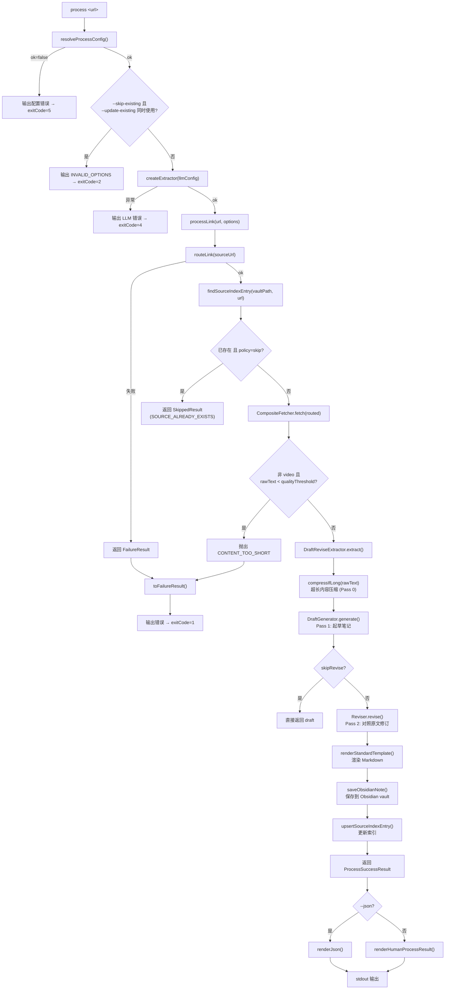

# LinkProcessingAgent

CLI-first link processing for Obsidian. Give it a URL, and it fetches the content, creates a high-fidelity Markdown note, and saves it into your vault.

## Quickstart

```bash
pnpm install
pnpm build
pnpm dev -- config init --vault /path/to/obsidian-vault
pnpm dev -- doctor
pnpm dev -- process https://example.com/article --llm-provider mock
```

Use `mock` only for smoke tests. For real notes, configure an OpenAI-compatible endpoint:

```bash
cp .env.example .env
```

Then edit:

```bash
LINK_PROCESSING_LLM_PROVIDER=draft-revise
LINK_PROCESSING_LLM_MODEL=Qwen3.5-4B-OptiQ-4bit
OPENAI_API_KEY=your-key
OPENAI_BASE_URL=http://127.0.0.1:11435/v1
```

## Commands

```bash
link-processing route <url> --json
link-processing inspect <url> --json
link-processing process <url>
link-processing process <url> --json
link-processing process <url> --skip-existing
link-processing process <url> --update-existing
link-processing config init --vault /path/to/vault
link-processing config check
link-processing doctor
```

## Config Precedence

`process` resolves configuration in this order:

1. CLI flags such as `--vault`, `--llm-provider`, and `--llm-model`
2. Environment variables such as `LINK_PROCESSING_VAULT` and `OPENAI_API_KEY`
3. `link-processing.config.yaml`
4. Built-in defaults

## Link Type Support

| Link type | Status | Process support | Notes |
|-----------|--------|-----------------|-------|
| Twitter/X | stable | yes | Uses fxtwitter JSON parsing. |
| Technical blog | stable | yes | Uses HTTP fetch, Readability, and Markdown conversion. |
| General article | stable | yes | Best for article-like HTML pages. |
| Docs | stable | yes | Static docs pages only; no crawler. |
| WeChat | beta | yes | HTTP extraction may work; Playwright fallback is not implemented. |
| Academic | beta | yes | HTML pages may work; PDF parsing is not implemented. |
| Video | route-only | no | Metadata and transcript extraction are not implemented. |

## Obsidian Output

Notes are saved under:

```text
文章摘要/<内容类型>/<YYYY-MM-DD-title>.md
```

Each note includes YAML frontmatter, readable source metadata, the generated Markdown body, knowledge connections, and the original URL.

## Deduplication

The CLI maintains a vault-local source index at:

```text
.link-processing/source-index.json
```

Use:

```bash
link-processing process <url> --skip-existing
link-processing process <url> --update-existing
```

## Troubleshooting

Run:

```bash
link-processing doctor
```

Doctor checks config loading, vault writability, provider setup, API key presence, and supported link capabilities.


