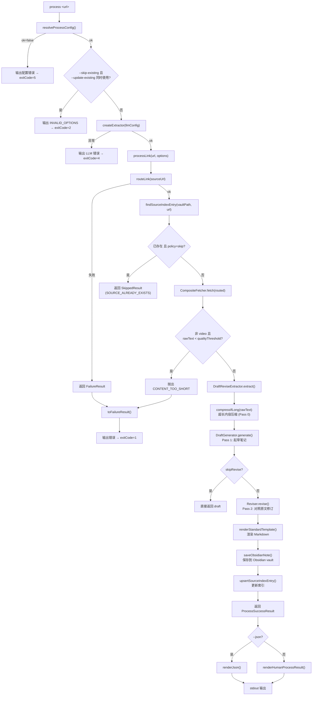

# 观（Guan）

CLI-first link processing for Obsidian. Give it a URL, and it fetches the content, creates a high-fidelity Markdown note, and saves it into your vault.

## Quickstart

```bash
pnpm install
pnpm build
pnpm dev -- config init --vault /path/to/obsidian-vault
pnpm dev -- doctor
pnpm dev -- process https://example.com/article --llm-provider mock
```

Use `mock` only for smoke tests. For real notes, configure an OpenAI-compatible endpoint:

```bash
cp .env.example .env
```

Then edit:

```bash
LINK_PROCESSING_LLM_PROVIDER=draft-revise
LINK_PROCESSING_LLM_MODEL=Qwen3.5-4B-OptiQ-4bit
OPENAI_API_KEY=your-key
OPENAI_BASE_URL=http://127.0.0.1:11435/v1
```

## HTTP Server

The project includes a built-in HTTP server for use with the Chrome extension or other clients.

```bash
# Development
pnpm dev -- serve

# Production
pnpm build
./dist/cli/index.js serve
```

The server starts on `http://127.0.0.1:8787` by default.

### Options

```bash
pnpm dev -- serve --port 3000              # custom port
pnpm dev -- serve --token my-secret         # require Bearer auth
pnpm dev -- serve --host 0.0.0.0 --allow-non-local  # bind to all interfaces
```

### API Endpoints

| Method | Path | Description |
|--------|------|-------------|
| GET | `/v1/healthz` | Health check (no auth) |
| GET | `/v1/doctor` | Run diagnostics |
| POST | `/v1/route` | Classify a URL |
| POST | `/v1/inspect` | Fetch and inspect a URL |
| POST | `/v1/process` | Process a URL into a note |
| POST | `/v1/process?stream=1` | Process with SSE streaming |

Request body for `/v1/process`:

```json
{
  "url": "https://example.com/article",
  "duplicatePolicy": "skip",
  "oss": true
}
```

### Chrome Extension

The `extensions/chrome/` directory contains a companion Chrome extension. After starting the server, load it as an unpacked extension in `chrome://extensions` and it will connect to `http://127.0.0.1:8787` automatically.

### Raycast 扩展

`extensions/raycast/` 目录包含一个本地 Raycast 扩展，界面文案为中文，交互保持简约：在 Raycast 中输入一个 URL，扩展直接调用 CLI，不需要 HTTP 服务。

```bash
cd extensions/raycast
npm install
npm run dev
```

在 Raycast 中运行 **保存链接到 Obsidian**，输入 URL，然后按 Enter。

如果仓库不在 `/Users/guanmo/Documents/projects/linkProcessing`，或希望切换源码/构建产物运行方式，请在 Raycast 偏好设置里调整项目路径和运行方式。

## Terminal UI

Build and register the CLI globally:

```bash
pnpm build
pnpm link --global
```

Run the terminal UI from any directory:

```bash
lpa
lpa https://mp.weixin.qq.com/s/example
link-processing tui https://example.com/article
```

Shortcuts:

- `q` or `Esc`: quit
- `r`: retry the current URL
- `Enter`: submit a URL on the input screen

The TUI reuses the same configuration as `link-processing process`: `.env`, `link-processing.config.yaml`, `LINK_PROCESSING_*`, `OPENAI_*`, and `OSS_*` are resolved through the shared process runner.

## Commands

```bash
link-processing route <url> --json
link-processing inspect <url> --json
link-processing process <url>
link-processing process <url> --json
link-processing process <url> --skip-existing
link-processing process <url> --update-existing
link-processing config init --vault /path/to/vault
link-processing config check
link-processing doctor
```

## Config Precedence

`process` resolves configuration in this order:

1. CLI flags such as `--vault`, `--llm-provider`, and `--llm-model`
2. Environment variables such as `LINK_PROCESSING_VAULT` and `OPENAI_API_KEY`
3. `link-processing.config.yaml`
4. Built-in defaults

## Link Type Support

| Link type | Status | Process support | Notes |
|-----------|--------|-----------------|-------|
| Twitter/X | stable | yes | Uses fxtwitter JSON parsing. |
| Technical blog | stable | yes | Uses HTTP fetch, Readability, and Markdown conversion. |
| General article | stable | yes | Best for article-like HTML pages. |
| Docs | stable | yes | Static docs pages only; no crawler. |
| WeChat | beta | yes | HTTP extraction may work; Playwright fallback is not implemented. |
| Academic | beta | yes | HTML pages may work; PDF parsing is not implemented. |
| Video | route-only | no | Metadata and transcript extraction are not implemented. |

## Obsidian Output

Notes are saved under:

```text
文章摘要/<内容类型>/<YYYY-MM-DD-title>.md
```

Each note includes YAML frontmatter, readable source metadata, the generated Markdown body, knowledge connections, and the original URL.

## Deduplication

The CLI maintains a vault-local source index at:

```text
.link-processing/source-index.json
```

Use:

```bash
link-processing process <url> --skip-existing
link-processing process <url> --update-existing
```

## OSS / S3-compatible Mirror

When OSS credentials are present in the environment, each processed note is mirrored to the configured bucket after the local save. In `OSS_MODE=only`, the note is uploaded to OSS without requiring an Obsidian vault.

Uploaded notes use this key layout:

```text
<OSS_PREFIX>/文章摘要/<内容类型>/<YYYY-MM-DD-title>.md
```

The CLI also maintains OSS indexes for reader workflows:

```text
<OSS_PREFIX>/source-index.json   # source URL deduplication
<OSS_PREFIX>/public-index.json   # public reader article list
```

If you already have Markdown articles in OSS from earlier runs, rebuild the public reader index without reprocessing source URLs:

```bash
pnpm dev -- reader sync-index
pnpm dev -- reader sync-index --json
```

This scans `<OSS_PREFIX>/文章摘要/**/*.md`, reads each note's YAML frontmatter, and rewrites `<OSS_PREFIX>/public-index.json`.

Minimum env vars:

- `OSS_ENDPOINT` (S3-compatible, e.g. `https://s3.oss-cn-hangzhou.aliyuncs.com`)
- `OSS_REGION`
- `OSS_BUCKET`
- `OSS_ACCESS_KEY_ID`
- `OSS_SECRET_ACCESS_KEY`

Optional:

- `OSS_PREFIX` - bucket path prefix
- `OSS_FORCE_PATH_STYLE` - needed for bucket names with underscores or MinIO/R2
- `OSS_MODE` - `mirror` by default, or `only` for OSS-only publishing
- `OSS_STRICT` - when `true`, an upload failure fails the whole process run
- `--no-oss` on `process` - one-shot disable

OSS uploads are best-effort by default: on failure the local note is still saved and the result JSON includes `oss.uploaded=false`. Run `link-processing doctor` to verify bucket connectivity.

Works with any S3-compatible service (AWS S3, MinIO, Cloudflare R2, Tencent COS, Qiniu Kodo) by pointing `OSS_ENDPOINT` at that service.

`public-index.json` updates are serialized within one running process. If multiple machines or multiple CLI processes publish to the same OSS prefix at the same time, publish serially or rebuild the public index afterward.

## Reader App

`apps/reader/` contains a React reader for Markdown articles published to OSS. It reads `public-index.json`, renders the article list, and loads Markdown article bodies by `path`. Markdown rendering uses `react-markdown` with `remark-gfm`.

Local preview:

```bash
pnpm reader:dev
```

The dev server starts on `http://127.0.0.1:5173/` and uses the fixture files under `apps/reader/public/`.

Production build:

```bash
pnpm reader:build
```

The static output is written to:

```text
dist/reader
```

Runtime config:

```bash
VITE_OSS_BASE_URL=https://bucket.example.com
VITE_OSS_INDEX_PATH=notes/public-index.json
```

If `VITE_OSS_BASE_URL` is omitted, the reader uses the current site origin. This works when `public-index.json` and article Markdown are deployed under the same domain as the reader.

OSS/CDN requirements:

- `public-index.json` must be publicly readable.
- Markdown article objects referenced by `articles[].path` must be publicly readable.
- CORS must allow `GET` from the reader domain.
- Serve `public-index.json` as `application/json`.
- Serve Markdown as `text/markdown; charset=utf-8` or a readable text content type.
- If a CDN caches `public-index.json`, keep its TTL short or purge it after publishing new articles.
- Configure static hosting fallback so `/articles/*` serves `index.html`; otherwise direct refreshes on article URLs can return 404.

## Troubleshooting

Run:

```bash
link-processing doctor
```

Doctor checks config loading, vault writability, provider setup, API key presence, and supported link capabilities.


